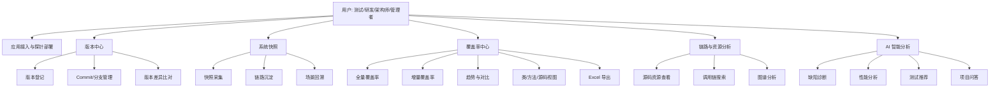
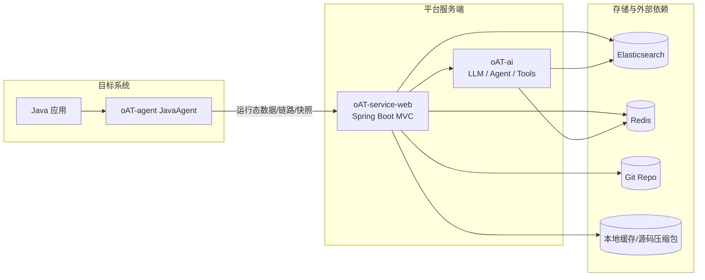
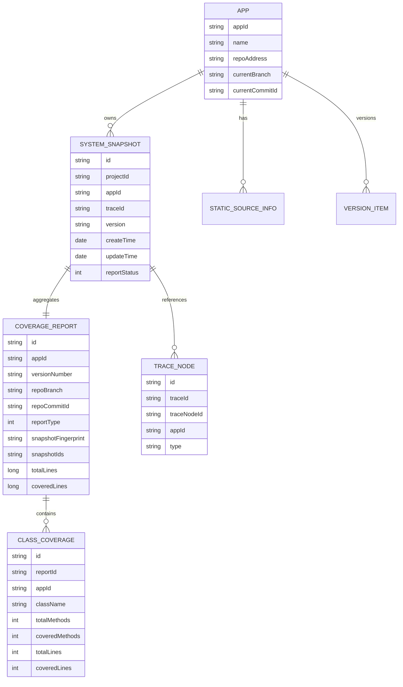
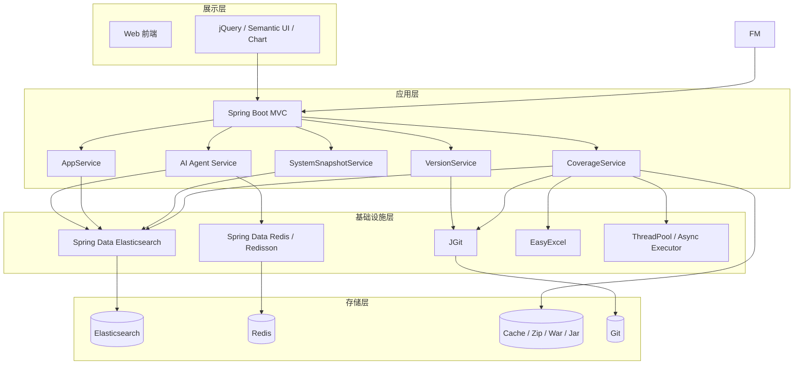
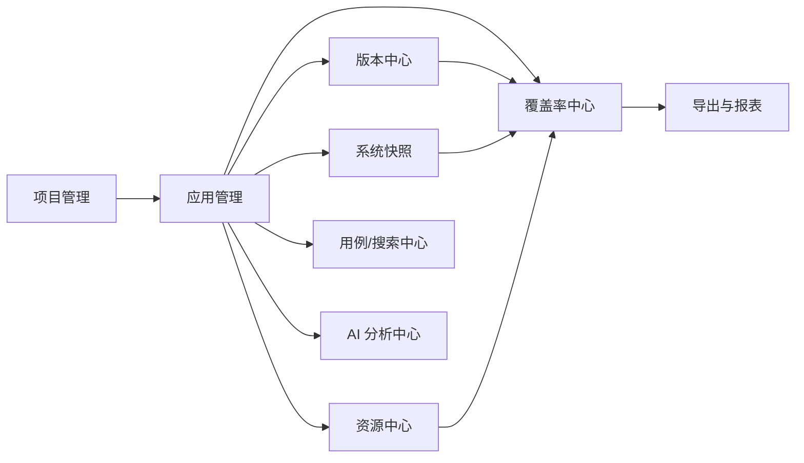
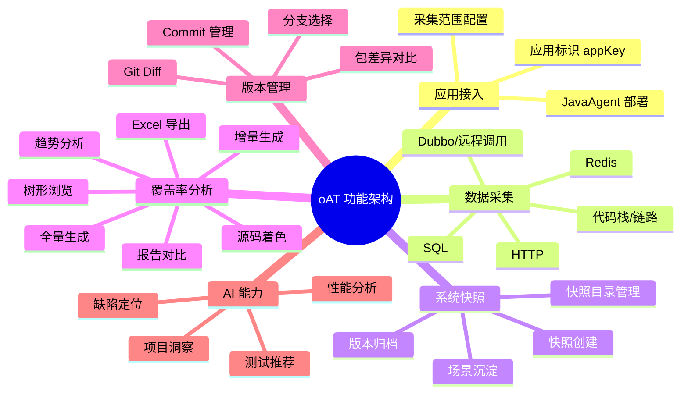
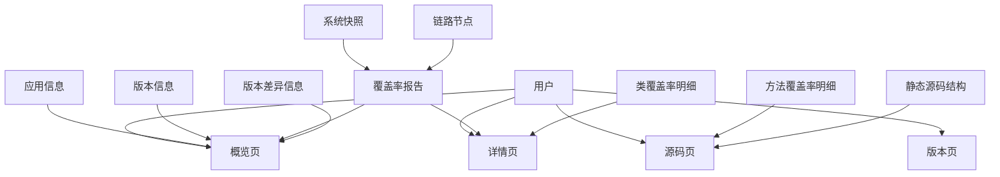
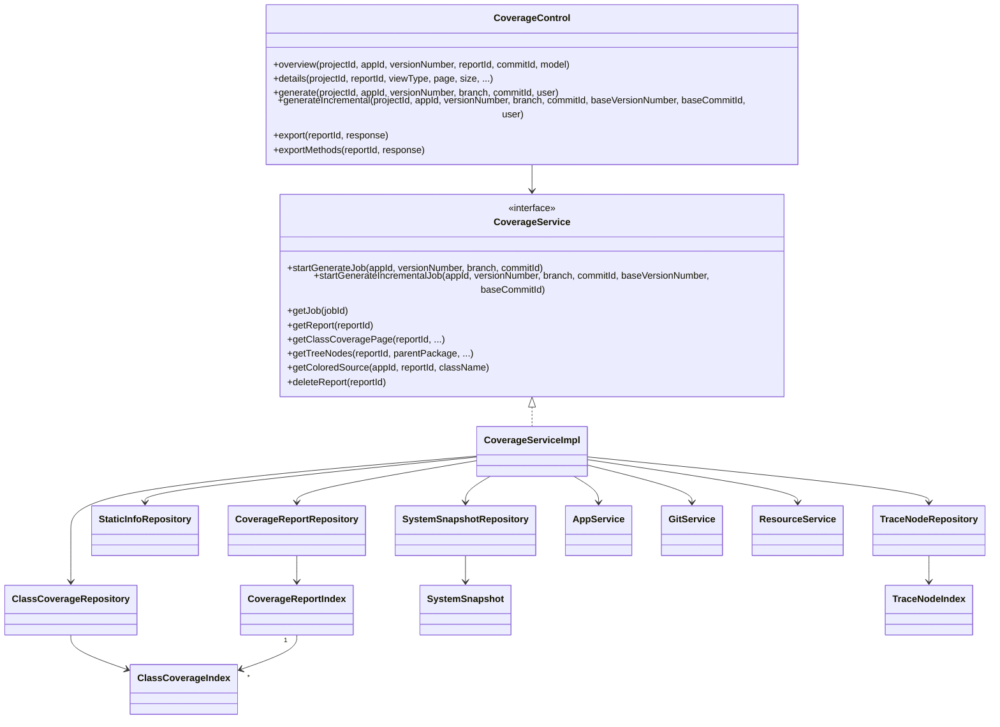
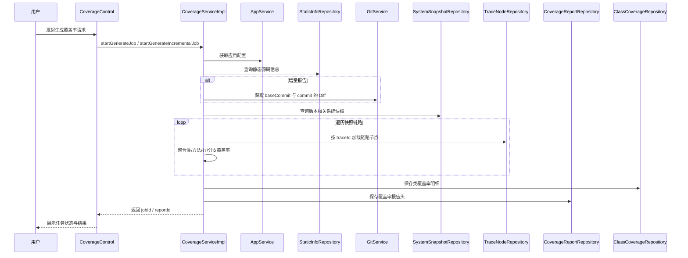
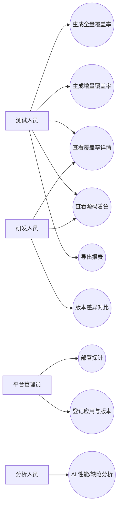

# oAccurateTest / oAT 项目架构说明

## 1. 项目概述

`oAccurateTest` 是一个围绕 Java 应用运行态观测、链路追踪、覆盖率分析、版本差异比对与 AI 辅助诊断构建的测试与分析平台。

项目当前主要由两部分组成：

- `oAT-agent`：以 `javaagent` 方式注入目标应用，采集运行时链路、代码栈、HTTP/SQL/Redis 等协议数据。
- `oAT-service`：平台服务端，负责接收采集数据、生成系统快照、展示覆盖率报告、进行版本对比，并提供 AI 能力扩展。

当前仓库的顶层结构如下：

```text
oAccurateTest
├── oAT-agent                # 目标系统探针/采集端
├── oAT-service              # 平台服务端聚合工程
│   ├── oAT-ai               # AI 能力模块（LangChain4j / 模型集成 / 智能工具）
│   └── oAT-service-web      # Web 平台、覆盖率、快照、版本、资源、搜索等核心业务
└── README.md
```

---

## 2. 项目总体说明

### 2.1 业务目标

平台的核心目标是：

1. 对目标 Java 系统进行无侵入运行态采集。
2. 沉淀系统快照、调用链路与源码结构信息。
3. 生成全量/增量覆盖率报告，支持趋势、对比、树形分析、源码着色。
4. 支持版本比对、资源缓存、报告导出。
5. 在服务端之上叠加 AI 能力，辅助代码理解、缺陷排查、性能分析和测试推荐。

### 2.2 主要模块职责

| 模块 | 职责 |
|---|---|
| `oAT-agent` | 通过 `javaagent` 注入业务应用，负责运行态采集与上报 |
| `oAT-service/oAT-service-web` | Web 平台主服务，负责页面展示、覆盖率生成、版本管理、系统快照、搜索与导出 |
| `oAT-service/oAT-ai` | AI 智能体、缓存、工具编排、模型适配与分析能力 |
| Elasticsearch | 存储覆盖率报告、类覆盖率、系统快照、链路节点、静态源码信息 |
| Redis | 缓存、会话、热点数据支持 |
| Git 仓库 | 提供代码版本、Commit、Diff、源码下载与比对基础 |

---

## 3. 七类架构图

以下架构图以当前代码实现为基础抽象，适合直接放在文档、汇报或方案评审中使用。

### 3.1 产品架构图



### 3.2 系统架构图



### 3.3 数据架构图



### 3.4 技术架构图



### 3.5 应用架构图



### 3.6 功能架构图



### 3.7 信息架构图



---

## 4. UML 图

### 4.1 UML 类图



### 4.2 UML 时序图



### 4.3 UML 用例场景图



---

## 5. 关键流程说明

### 5.1 覆盖率生成主流程

1. 用户在平台中选择应用、版本、分支、Commit。
2. 控制层发起异步任务。
3. 服务层读取应用配置、静态源码信息、版本信息。
4. 若为增量报告，则根据 `baseCommitId -> commitId` 获取 Git Diff。
5. 服务层从 `system_snapshot` 中获取当前版本下的快照集合。
6. 逐个读取 `trace_node`，将实际执行过的方法、分支、代码行合并到类覆盖率对象中。
7. 计算汇总指标，落库到 `coverage_report` 和 `class_coverage`。
8. 前端可查看概览、详情、树形结构、源码着色，以及导出 Excel。

### 5.2 AI 分析流程

1. 平台侧从覆盖率、链路、快照、版本、源码信息中获取上下文。
2. `oAT-ai` 内的 Agent 工具组件选择对应分析工具。
3. 根据场景执行缺陷检测、调用链比较、性能分析、测试推荐等能力。
4. 结果回传到页面或交互接口。

---

## 6. 部署注意项

### 6.1 基础依赖要求

部署平台前，至少需要准备以下依赖：

- JDK 17+
- Maven 3.8+
- Elasticsearch
- Redis
- 可访问的 Git 仓库
- 被观测目标系统（Java）

### 6.2 推荐启动顺序

建议按以下顺序启动：

1. 启动中间件：Elasticsearch、MySQL（如项目配置中使用）、Redis。
2. 启动 `oAT-service-web` 平台服务。
3. 启动已挂载 `javaagent` 的目标应用。
4. 再进行版本登记、快照采集与覆盖率生成。

### 6.3 构建顺序要求

由于 `oAT-service-web` 依赖 `oAT-client-model` 与 `oAT-ai`，建议构建顺序如下：

1. 先构建 `oAT-agent` 内相关模型包，使 `oAT-client-model` 安装到本地仓库。
2. 构建 `oAT-service/oAT-ai`。
3. 构建 `oAT-service/oAT-service-web`。
4. 最后部署 `war` 或直接使用 Spring Boot 方式启动。

### 6.4 Agent 部署注意

- `javaagent` 参数必须在 JVM 启动参数中显式指定。
- `appKey` 必须与平台侧的应用配置一致。
- 采集范围配置过大时，会显著增加运行时开销与数据量。
- 修改 agent 配置后应重启目标应用生效。
- 栈深、队列、线程池参数应按业务并发量调整，不建议直接使用极限配置。

### 6.5 服务端部署注意

- `Elasticsearch` 地址、用户名、密码需正确配置。
- 平台服务需要具备本地缓存目录的读写权限，用于 Git 下载包、源码缓存、比对文件缓存。
- 若通过 Nginx/Tomcat 转发，需要放宽大请求体限制，避免上传源码包、导出报表或大体量请求失败。
- `war` 包部署到外部容器时，应确认 Servlet 版本兼容。
- MacOS 下项目已经声明 Netty DNS 本地解析依赖，Linux 部署时需关注网络与 DNS 环境差异。

### 6.6 AI 模块注意

- `oAT-ai` 依赖 Java 17 与 LangChain4j。
- 使用本地模型或外部模型时，需要提前准备对应模型服务地址和鉴权配置。
- AI 能力依赖基础业务数据质量，若快照、链路、源码索引不完整，AI 分析效果会下降。

---

## 7. 使用注意项

### 7.1 使用前提

在生成覆盖率或做 AI 分析前，应先满足以下前提：

- 已创建项目与应用。
- 已配置应用仓库地址、账号、密码或可访问方式。
- 已有静态源码信息入库。
- 当前版本已存在系统快照数据。
- 目标应用已接入 agent 并产生真实链路。

### 7.2 覆盖率使用建议

- 全量覆盖率适合基线评估、阶段回顾、版本验收。
- 增量覆盖率适合提交评审、变更验证、回归测试优先级排序。
- 如果报告显示“没有快照”或“没有静态源码”，应先补齐前置数据，而不是反复重试生成。
- 若 Commit 切换后源码结构变化较大，应重新生成报告，不建议过度依赖旧报告继承。

### 7.3 版本与快照建议

- 一个版本号应尽量绑定明确的分支与 Commit。
- 快照应与版本语义一致，避免不同版本数据混入同一版本号下。
- 对于增量报告，`baseCommitId` 和目标 `commitId` 必须属于同一代码演进链，否则 Diff 结果可能失真。

---

## 8. 要求项

### 8.1 环境要求

| 类别 | 要求 |
|---|---|
| Java | JDK 17+ |
| 构建 | Maven 3.8+ |
| Web 服务 | Spring Boot 2.7.x |
| 缓存 | Redis |
| 检索存储 | Elasticsearch |
| 代码比对 | Git 仓库可访问 |
| 目标应用 | 支持 `javaagent` 注入的 Java 应用 |

**举例说明：**

- 例如在一台新测试机上部署平台时，若机器只有 JDK 8，那么 `oAT-service-web` 和 `oAT-ai` 都无法按当前工程配置正常运行，因为工程 POM 已要求 Java 17。
- 例如平台能访问 Redis，但无法访问 Git 仓库，那么页面虽然能打开，但在生成增量覆盖率时会因无法获取 Commit Diff 而失败。
- 例如目标系统是非 Java 程序，或启动参数不允许增加 `-javaagent`，那么该系统无法接入当前采集体系。

**更具体的落地示例：订单系统接入前检查**

假设现在要接入一个真实业务应用 `order-service`，准备在测试环境生成 `v1.2.3` 的覆盖率报告，那么环境要求可以具体拆成下面这些检查项：

| 检查项 | 正确示例 | 错误示例 | 结果 |
|---|---|---|---|
| Java 版本 | `java -version` 显示 17 | 仍然是 1.8 | 服务端启动失败，或 AI 模块无法初始化 |
| Maven 构建 | `mvn clean install` 正常 | 本地 Maven 过旧或依赖拉取失败 | 无法打包部署 |
| ES 连通性 | 平台能连到 `10.0.0.8:9200` | 端口不通/账号密码错 | 快照、链路、报告无法查写 |
| Redis 连通性 | 平台能连到 `10.0.0.9:6379` | Redis 未启动 | 缓存、会话、部分能力异常 |
| Git 连通性 | 能拉取 `release/1.2` 分支 | 仓库地址写错 | 增量覆盖率、源码校验失败 |
| Agent 注入能力 | JVM 启动参数可加入 `-javaagent` | 中间件平台禁止自定义 JVM 参数 | 目标系统无法被采集 |

进一步举例：

1. `order-service` 部署在测试机 `10.20.1.15` 上，平台部署在 `10.20.1.8` 上。  
   若 `10.20.1.8` 能访问 ES/Redis，但无法访问 GitLab `10.20.5.21`，则：
   - 快照查看可能正常；
   - 已有报告查询可能正常；
   - 但“生成增量覆盖率”“查看指定 Commit 源码”会失败。

2. 若 `order-service` 使用的运行容器不允许加入：

```bash
-javaagent:/opt/oat/oAT-agent-core-1.0-SNAPSHOT.jar=appKey=order-service
```

则这个应用根本不会产生运行态链路，后续即使在平台上登记了应用和版本，也生成不出真实覆盖率。

3. 若平台部署时只校验了“服务能启动”，没有校验“Git 凭证是否正确”，则常见现象是：
   - 登录和基础页面都正常；
   - 一到生成增量覆盖率才报错；
   - 用户会误以为是覆盖率模块有 bug，实际上是环境要求没有满足。

### 8.2 数据要求

| 项 | 要求 |
|---|---|
| 应用配置 | `appId`、仓库地址、分支、Commit 信息完整 |
| 静态源码 | 已完成扫描或上传，类结构可检索 |
| 系统快照 | 当前版本下至少存在一个有效快照 |
| 链路节点 | `traceId` 与快照可正确关联 |
| 覆盖率生成 | 需能读取类、方法、分支、行号等结构信息 |

**举例说明：**

- 例如应用 `order-service` 已在平台登记，但没有导入静态源码信息，那么覆盖率生成时会出现“找不到静态源码数据”，因为系统无法知道类、方法、行号的静态结构。
- 例如版本 `v1.2.3` 已登记，但这个版本下没有任何 `system_snapshot` 数据，那么无法生成覆盖率，因为覆盖率统计依赖运行时快照和链路。
- 例如快照里记录了 `traceId=abc123`，但 `trace_node` 索引中查不到这条链路，那么这部分执行数据就无法被合并到覆盖率结果中。
- 例如当前应用仓库地址配置错了，平台拿到的是错误仓库，那么即使有快照，也可能出现类名对不上、源码着色错位的问题。

**更具体的落地示例：一次完整的覆盖率数据准备过程**

假设要为 `order-service` 生成 `v1.2.3` 版本、`release/1.2` 分支、`commitId=9ab34ef` 的覆盖率报告，那么至少应具备以下数据：

| 数据项 | 示例值 | 来源 | 若缺失会怎样 |
|---|---|---|---|
| 应用信息 | `appId=order-service` | 平台应用配置 | 无法定位应用 |
| 仓库信息 | `git@gitlab.xxx:trade/order-service.git` | 应用配置 | 无法拉源码/比对 Commit |
| 静态源码 | `OrderController`、`OrderService`、`PaymentService` 等类结构已入库 | 静态扫描/上传 | 无法建立类、方法、行号基础 |
| 版本信息 | `versionNumber=v1.2.3` | 版本中心 | 无法正确归档报告 |
| 快照数据 | 3 个系统快照，分别来自下单、支付、取消订单流程 | 运行态采集 | 报告没有执行依据 |
| 链路数据 | `traceId=t1001/t1002/t1003` 对应链路节点存在 | trace_node 索引 | 只能看到快照，无法统计真实覆盖 |

可以把它理解为一个最小闭环：

1. 平台中先创建应用 `order-service`。  
2. 配置仓库地址、分支、Commit。  
3. 上传或扫描该 Commit 对应的静态源码。  
4. 目标应用挂载 agent 后执行自动化测试。  
5. 平台收到 3 个系统快照。  
6. 每个快照都能查到对应 `traceId` 的链路节点。  
7. 这时再生成覆盖率，才能得到可信结果。

如果缺任何一步，问题会非常具体：

- 缺静态源码：系统知道“跑了什么”，但不知道“这些运行数据在源码里对应哪一行”。
- 缺快照：系统知道“代码长什么样”，但不知道“这次测试实际跑到了哪里”。
- 缺链路节点：系统知道“发生过一次场景”，但没有过程数据，无法统计类/方法/分支覆盖率。
- 仓库配置错误：系统会把 `commitId=9ab34ef` 当成目标版本，但拉到的却是另一个仓库的内容，导致源码视图与运行数据错位。

### 8.3 运维要求

| 项 | 要求 |
|---|---|
| 网络 | 平台需能访问 ES / Redis / Git |
| 权限 | 服务需有本地缓存目录读写权限 |
| 容量 | ES 与本地磁盘需有足够容量支撑快照与源码缓存 |
| 重启策略 | 配置变更后应允许平台或目标应用重启 |

**举例说明：**

- 例如 Linux 服务器上把缓存目录挂载成只读，那么 Git 源码下载包、对比缓存文件、源码压缩包都无法落盘，版本比对和覆盖率源码查看都会受影响。
- 例如 Elasticsearch 磁盘已接近打满，快照与链路持续写入时可能出现写入失败，最终导致覆盖率报告不完整或页面查询异常。
- 例如修改了 agent 的采集包配置，但业务系统没有重启，那么平台看到的仍是旧采集范围，用户会误以为“配置未生效”。
- 例如服务端能访问 ES 和 Redis，但防火墙阻断了 Git 仓库地址，那么只有依赖 Git 的能力会失败，比如增量覆盖率、Commit 对比、源码校验。

**更具体的落地示例：生产前运维检查单**

假设平台准备上线到 `prod-oat-01`，同时接入 `order-service`、`payment-service` 两个应用，那么运维检查不能只写“服务可用”，而应具体到：

| 检查项 | 正常值示例 | 异常示例 | 业务影响 |
|---|---|---|---|
| 本地缓存目录 | `/data/oat/cache` 可读可写 | 目录不存在或只读 | Git 下载、源码查看、版本比对失败 |
| ES 磁盘水位 | 使用率 60% | 使用率 92% | 快照写入失败、查询变慢 |
| Redis 可用性 | PING 正常，延迟低 | Redis 经常超时 | 页面会话、缓存能力不稳定 |
| Git 访问 | 能拉取业务仓库 | 访问需跳板但未配置 | 增量覆盖率失败 |
| 服务重启窗口 | 夜间可重启 | 不允许重启 | 配置修改无法生效 |

进一步举例：

1. 运维把缓存目录配置为 `/opt/oat/cache`，但该目录属主是 `root`，应用进程是 `oat` 用户。  
   结果：
   - 登录平台正常；
   - 查已有数据正常；
   - 一旦执行版本比对或源码查看，就会因为无法写入缓存而失败。

2. ES 当前剩余磁盘只有 20GB，而两个核心应用每天能新增数十万条链路节点。  
   结果：
   - 前几天平台正常；
   - 到高峰期开始出现快照保存失败；
   - 覆盖率报告越来越不完整；
   - 用户以为是测试没覆盖，实际上是数据根本没写进去。

3. 平台配置修改后未安排重启窗口。  
   比如把 `service.include` 从 `com.demo.order.*` 改成 `com.demo.order.*&com.demo.payment.*`，但业务应用不停机。  
   结果：支付链路仍不会被采集，业务方会认为“平台没有采到支付流程”，其实是变更没有生效。

---

## 9. 性能说明

### 9.1 性能特点

本项目的性能瓶颈主要集中在以下几个环节：

1. **运行态采集开销**：agent 对 HTTP、SQL、Redis、方法栈等采集会引入额外消耗。
2. **覆盖率聚合耗时**：快照越多、链路越长、类越多，报告生成耗时越高。
3. **Git Diff 与源码处理**：增量覆盖率依赖 Git 差异比对和源码文件匹配。
4. **Elasticsearch 查询/写入性能**：报告查询、快照读取、链路节点聚合高度依赖 ES 性能。
5. **源码着色与导出**：在大类、大方法、大报表场景下，HTML 着色和 Excel 导出会明显变慢。

**举例说明：**

- 例如一个只有 20 个核心类的小应用，只有 5 个快照，那么生成全量覆盖率可能很快完成；但如果是一个有 3000+ 类、上千条链路、几十个快照的核心交易系统，生成时间会明显增长。
- 例如把 `service.include` 配成了整个公司公共包 `com.company.*`，那么很多与本次测试无关的方法也会被采集，业务请求耗时和链路存储量都会上升。
- 例如一个版本只改了 3 个类，此时增量覆盖率通常比全量覆盖率更轻；但如果两个 Commit 之间差异很大，Git Diff 与源码对齐本身也会带来明显计算成本。
- 例如单个类包含超长方法、非常多分支和大量源码行，那么源码着色页在打开时会更慢，导出方法级 Excel 也会更耗时。

**更具体的落地示例：同一平台上的轻量应用与重型应用对比**

假设平台同时接入两个系统：

| 指标 | 轻量应用 `demo-order` | 重型应用 `trade-core` |
|---|---|---|
| 类数量 | 30 | 3200 |
| 本次版本快照数 | 4 | 48 |
| 单条链路平均节点数 | 20 | 350 |
| 变更类数量 | 2 | 180 |
| 报告生成感受 | 通常较快 | 明显更慢 |

在这两个应用中，性能表现会很不一样：

1. `demo-order` 只做了“下单”和“查询订单”两个场景，4 个快照就能覆盖大部分流程。  
   这时生成全量报告，通常用户感觉是“点一下，稍等即可”。

2. `trade-core` 包含下单、支付、库存冻结、优惠券、风控、消息投递等很多模块。  
   即使只是一个版本，也可能沉淀 40+ 个快照，每个快照背后都有很长的调用链。  
   这时平台要处理：
   - 更多类；
   - 更多方法；
   - 更多分支；
   - 更多 trace 节点；
   所以报告生成自然更慢。

3. 若 `trade-core` 还把采集范围配置成：

```properties
conf_service.include=com.company.*
```

那就意味着不仅交易主链路会被采集，连公共 SDK、基础组件、其他业务模块也可能一起进入统计。结果通常是：

- 请求侧开销增加；
- `trace_node` 数据量放大；
- 报告生成耗时上涨；
- 页面筛选与导出也更慢。

4. 若某个类如 `PromotionEngineService` 有一个 800 行的大方法，里面带大量条件分支，那么：
   - 生成源码着色 HTML 时需要处理更多行；
   - 方法级覆盖率计算更重；
   - 导出方法级 Excel 时也会更慢。

### 9.2 当前设计中的性能优化点

从现有实现可见，系统已经包含一些性能优化思路：

- 使用异步任务生成覆盖率，避免阻塞页面请求。
- 使用固定线程池处理报告任务。
- 对 Git Diff 结果和 Zip 文件条目做缓存，减少重复 IO。
- 支持复用上一份可继承报告，降低重复全量计算成本。
- 覆盖率详情支持分页、树形懒加载，避免一次性返回全部类明细。

### 9.3 性能建议

- 在高并发接入环境中，优先缩小采集范围，避免全量 instrumentation。
- ES 建议独立部署并监控索引容量、查询耗时、分片数量。
- 对大仓库建议预热 Git 缓存，并控制源码压缩包大小。
- 对超大版本报告建议按应用、版本、场景拆分生成。
- Redis/本地缓存目录应位于性能稳定的磁盘介质上。

---

## 10. 正确性说明

### 10.1 正确性的含义

本项目中的“正确性”主要体现在以下几个方面：

1. **版本正确性**：覆盖率、源码、Git Diff 必须对应同一版本语义。
2. **快照正确性**：系统快照与链路数据必须属于同一业务场景与应用。
3. **映射正确性**：运行时执行方法、行号、分支要能准确映射回静态源码结构。
4. **统计正确性**：报告汇总值必须由类明细稳定汇总而来，不能出现口径漂移。
5. **增量正确性**：增量报告只统计真实发生变化的类和行，且基准版本要可追溯。

**举例说明：**

- 例如页面选择的是 `release/1.3` 分支下的 `commitA`，但静态源码却来自 `commitB`，那么类结构和源码行号可能对不上，最终造成覆盖率着色错位。
- 例如同一个 `versionNumber` 下混入了两次不同发布日期的快照，那么报告统计出来的覆盖率其实不再代表某一个确定版本，而是“混合版本”的结果。
- 例如运行时方法签名已变化，但静态源码索引未刷新，那么系统可能还能找到同名方法，却把覆盖行数打到错误的方法结构上。
- 例如报告头显示总覆盖类数为 120，但类明细实际汇总只有 118 个，这就属于统计口径错误，需要排查汇总过程。
- 例如增量报告本应只看 `UserService` 和 `OrderService` 两个变更类，但因为基准 Commit 选错，系统把 `InventoryService` 也识别成了变更类，那么这份增量报告就不准确。

**更具体的落地示例：一次“看起来成功、其实不正确”的报告**

假设测试团队为 `order-service` 生成了 `v1.2.3` 的一份全量报告，页面上也成功展示了覆盖率百分比，但这份报告仍然可能是不正确的。

### 场景 1：版本不一致

- 平台上选择的版本信息：
  - `branch=release/1.2`
  - `commitId=9ab34ef`
- 实际测试环境部署的应用代码：
  - `commitId=7cd88aa`

此时用户会看到：

- 报告能生成；
- 类名大部分看起来也正常；
- 但源码着色、方法覆盖、分支覆盖可能已经偏离真实测试对象。

这类问题最危险，因为它不是“直接报错”，而是“结果看起来有道理”。

### 场景 2：快照混入别的测试轮次

假设 `v1.2.3` 这个版本号下，本来只想统计本轮回归测试的 10 个快照，但实际上历史上已经留了 8 个老快照：

- 老快照：来自上周冒烟测试
- 新快照：来自今天回归测试

最终这份报告看起来覆盖率很高，比如从 45% 变成了 71%。  
但真实原因可能不是“这轮测试补得很好”，而是“老数据混进来了”。

### 场景 3：静态源码未更新

假设 `OrderService#submit(OrderReq req)` 在新版本里改成了：

```java
submit(OrderReq req, String channel);
```

但平台静态源码里还是旧签名。  
那么运行时链路虽然采集到了新的方法调用，系统在做方法映射时却可能：

- 找到同名旧方法；
- 把覆盖数据挂错位置；
- 或者直接丢失这部分方法覆盖率。

### 场景 4：增量基线选错

假设本次真正想比的是：

- 基线：`commit=1001aaa`
- 目标：`commit=1002bbb`

但用户误选成：

- 基线：`commit=0990zzz`
- 目标：`commit=1002bbb`

结果会出现：

- 变更类比预期多很多；
- 增量覆盖率看起来很低；
- 研发误以为这次提交风险很大；
- 实际上只是基线范围扩大了。

### 10.2 正确性的依赖条件

要保证结果正确，需要满足：

- `appId`、版本号、分支、Commit 配置准确。
- 静态源码结构与目标 Commit 对齐。
- 快照中的 `traceId` 能查询到对应链路节点。
- 运行态采集配置未错误排除关键包/方法。
- 代码变更发生后及时刷新静态源码或重新生成报告。

**举例说明：**

- 例如把 `order-service` 的 `appId` 错配成 `payment-service`，那么平台会把错误应用的数据拿来生成报告，结果看起来“有数据”，但业务含义完全错误。
- 例如关键业务入口方法被配置在 `service.excludeMethod` 中，那么即使真实执行过，最终报告里也会显示未覆盖。
- 例如代码已经升级到新 Commit，但平台还沿用老的静态源码结构，那么类名可能还在，方法参数和分支位置却已经变了。

**更具体的落地示例：正确性依赖链条**

可以把正确性理解为一条连续链路：

```text
应用配置正确
-> 版本/Commit 选择正确
-> 静态源码与 Commit 对齐
-> 运行态快照属于该版本
-> traceId 能查到链路节点
-> 采集范围没有误排除关键方法
-> 最终报告才可信
```

只要其中一环出错，最后结果就可能“能看，但不真”。

例如：

1. **应用配置错误**  
   本应选择 `appId=order-service`，却误用了 `payment-service`。  
   则平台会从错误应用下查询快照、链路、源码，结果整份报告业务对象就错了。

2. **方法被错误排除**  
   配置里写了：

```properties
service.excludeMethod=submit(* )
```

如果这条规则本意是排除某个非关键方法，但实际匹配到了订单主提交流程，那么测试明明跑过下单，报告仍会显示 `OrderService.submit` 未覆盖。

3. **静态源码滞后**  
   业务代码当天已经发版，但平台静态源码还停留在昨天版本。  
   则即使快照和链路都是真实的，最终映射回源码时仍可能错位。

所以，正确性不是单点问题，而是“配置正确 + 数据正确 +映射正确 + 统计正确”共同成立。

### 10.3 常见正确性风险

| 风险 | 表现 |
|---|---|
| Commit 不一致 | 报告展示的类与当前代码不一致 |
| 快照混入旧版本数据 | 覆盖率异常偏高或偏低 |
| 采集范围配置不当 | 关键代码未被统计 |
| Git Diff 基准错误 | 增量报告缺类、缺行或口径失真 |
| 静态源码未更新 | 源码着色错位、方法统计不准 |

**举例说明：**

- 例如研发在平台上选择了 `commit=abc111`，但目标系统实际部署的是 `commit=xyz999`，此时看起来也能生成报告，但对应关系已经偏离真实线上代码。
- 例如压测环境产生的快照和功能测试环境产生的快照都被放进同一版本下，那么覆盖率可能异常偏高，误导大家以为功能测试已经覆盖很多场景。
- 例如为了降低开销，把 `com.demo.controller.*` 全部排除了，结果所有入口流量都没被统计到，覆盖率会异常偏低。
- 例如做增量分析时把上周的基线 Commit 当成昨天的基线 Commit，Diff 范围会扩大，导致本应很小的一次变更被统计成大量变更。
- 例如源码已经新增了一个 if/else 分支，但平台还在使用旧源码索引，那么分支覆盖率的统计口径会出现偏差。

**更具体的落地示例：常见错误与表象对照表**

| 实际问题 | 页面表象 | 容易被误判成什么 |
|---|---|---|
| 目标环境 Commit 与平台选择不一致 | 源码着色看起来“差不多对”，但局部方法不对 | 误以为平台着色算法有 bug |
| 历史快照混入当前版本 | 覆盖率突然偏高 | 误以为测试覆盖提升很大 |
| 入口方法被排除采集 | Controller/Service 大面积未覆盖 | 误以为测试根本没跑到入口 |
| 增量基线选错 | 变更类数量异常多 | 误以为本次提交改动太大 |
| 静态源码落后 | 方法覆盖率、分支覆盖率不稳定 | 误以为运行时采集不准 |

这个表很重要，因为很多正确性问题不会直接报异常，而是以“数字不对劲”的形式表现出来。  
如果没有对照表，团队很容易把数据问题误判成测试问题或产品问题。

### 10.4 正确性保障建议

- 把版本号、分支、Commit 作为一个整体进行管理。
- 快照生成时绑定明确版本，不混用不同发布阶段数据。
- 静态源码、快照、链路、报告生成应形成串联流水线。
- 重大版本发布前优先生成一份全量基线报告，再生成增量报告。
- 对关键应用定期抽样校验“链路 -> 类 -> 方法 -> 行号”映射结果。

**举例说明：**

- 例如发布 `v2.0.0` 时，在版本中心固定记录 `branch=release/2.0`、`commitId=8f3a2c1`，后续所有快照和报告都围绕这一组信息运转。
- 例如每日构建流水线中先执行“上传静态源码 -> 运行自动化测试产生快照 -> 生成全量报告 -> 对比最近提交生成增量报告”，就比人工分散操作更能保证一致性。
- 例如对支付下单主流程，抽样挑 1 条真实链路，人工校验是否正确落到了 `OrderController#create`、`OrderService#submit`、`PaymentService#pay` 等关键方法上，可以有效验证映射正确性。

**更具体的落地示例：如何验收一份报告是否可信**

假设团队刚生成了一份 `order-service v1.2.3` 的报告，不要只看首页覆盖率数字，而应该做最少 4 步验收：

1. **验版本**  
   检查报告中的 `branch`、`commitId` 是否与测试环境部署版本一致。

2. **验快照**  
   抽查 2~3 个关键业务场景，比如：
   - 下单成功
   - 支付成功
   - 取消订单  
   确认这些场景确实在当前版本下形成了系统快照。

3. **验链路**  
   任意挑一个快照，检查其 `traceId` 是否真能关联到完整链路节点，而不是只有一个空壳快照。

4. **验源码映射**  
   抽查关键方法是否符合预期，例如：
   - `OrderController#createOrder` 应被标记为已覆盖；
   - `OrderService#submit` 应被标记为已覆盖；
   - `PaymentService#refund` 若这轮没测，应保持未覆盖。

如果这 4 步都通过，那么这份报告通常才值得被用于：

- 测试评审；
- 版本发布判断；
- 回归范围裁剪；
- AI 风险分析输入。

否则，即使报告页面能打开、数字也很好看，也不应该直接拿来做决策。

---

## 11. 典型部署与使用命令

### 11.1 启动服务端

```bash
nohup java -jar oAT-service-web-1.0-SNAPSHOT.war > output.log 2>&1 &
```

### 11.2 目标系统挂载探针

```bash
-javaagent:{app_home}/oAT-agent-core-1.0-SNAPSHOT.jar=appKey=1xxx
```

### 11.3 常见大请求体配置示例

```properties
server.tomcat.max-http-post-size=100MB
```

---

## 12. 建议的文档维护方式

建议后续每次涉及以下改动时同步更新本 README：

- 新增或删除核心模块
- 覆盖率生成流程变更
- 索引结构或数据口径变更
- 部署前置条件变更
- AI 工具链和模型接入方式变更

这样 README 就不仅是“启动说明”，还可以作为项目的统一架构说明书。
