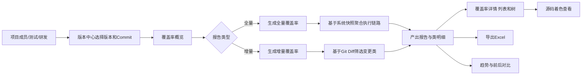
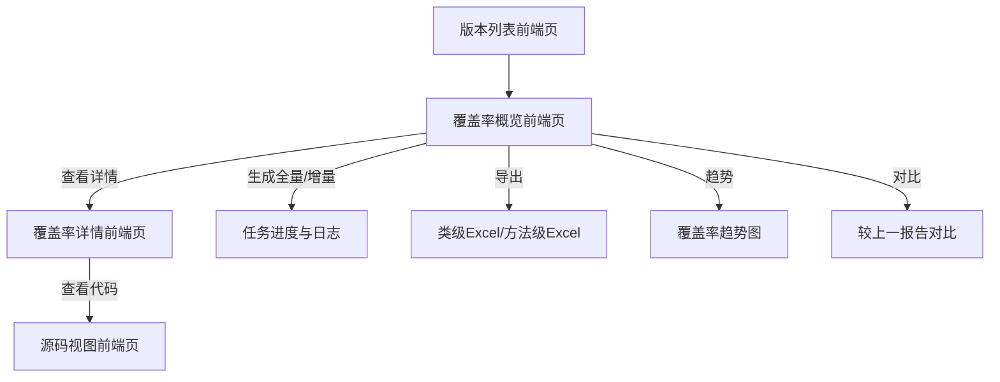
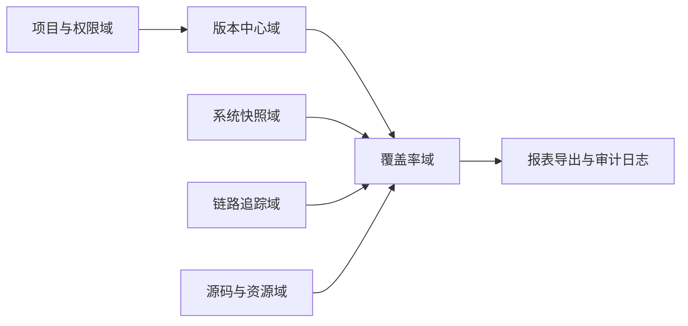
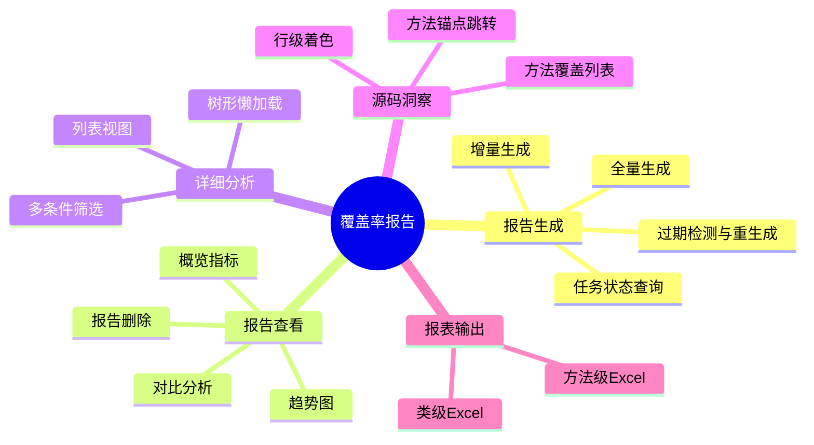
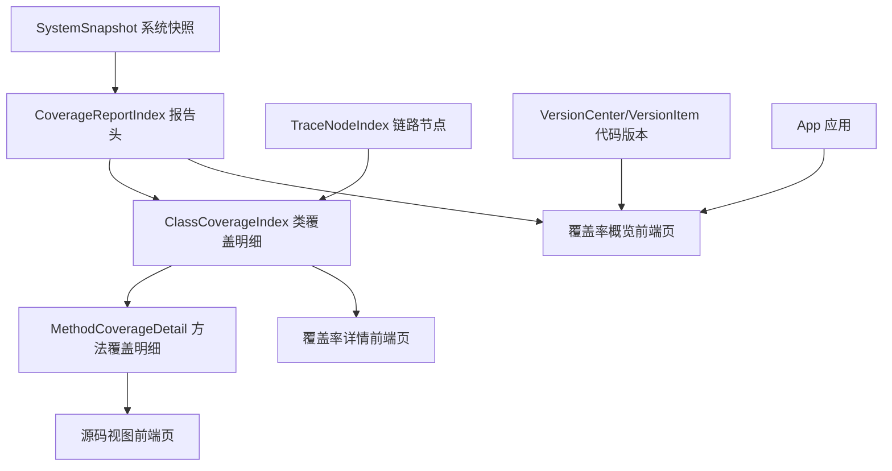
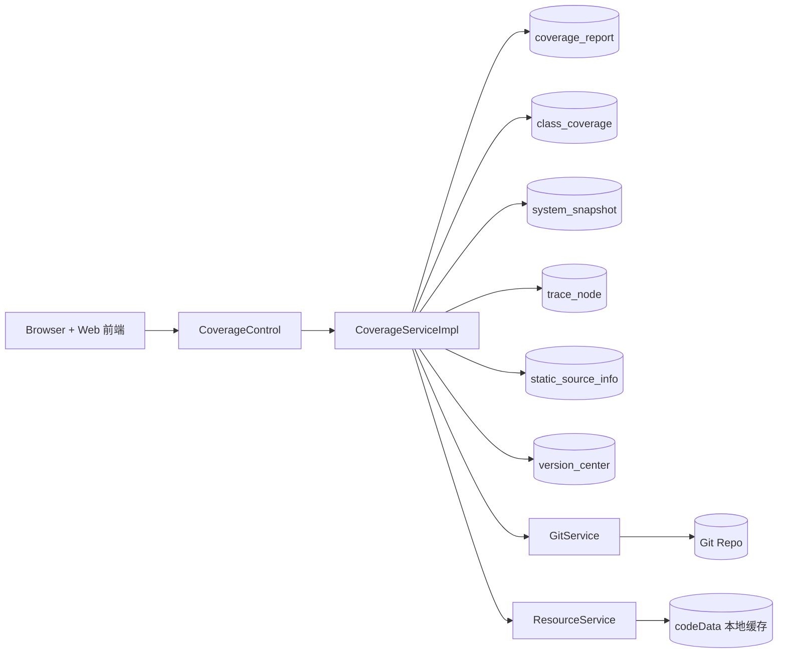
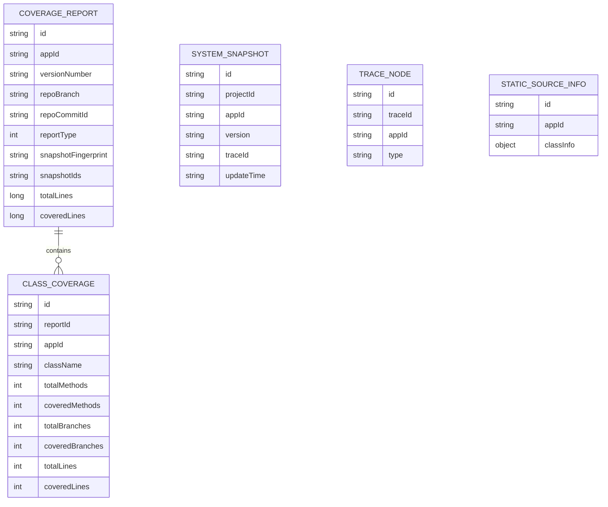
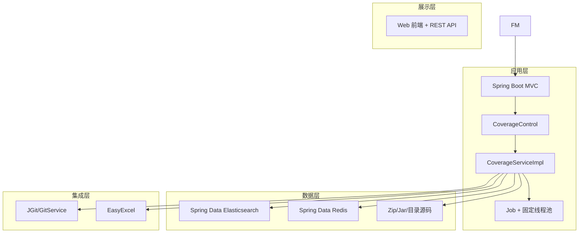
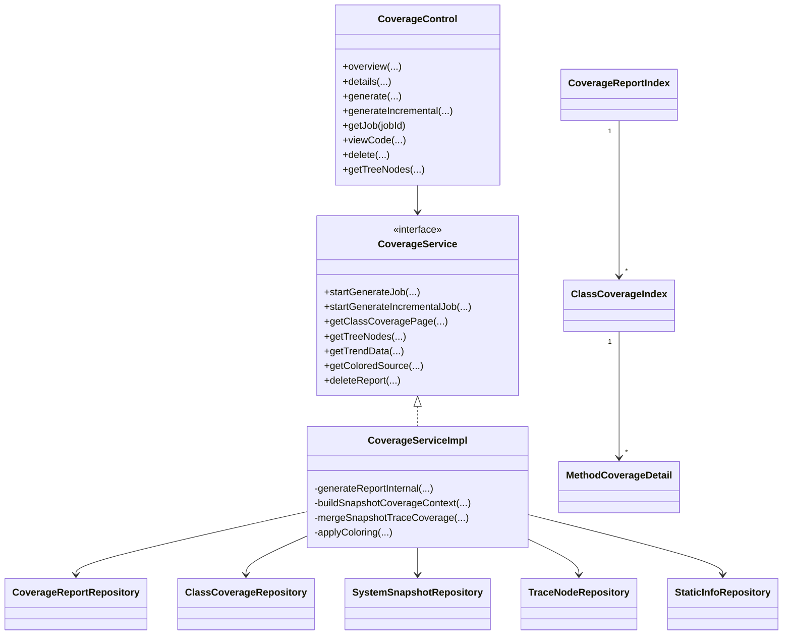
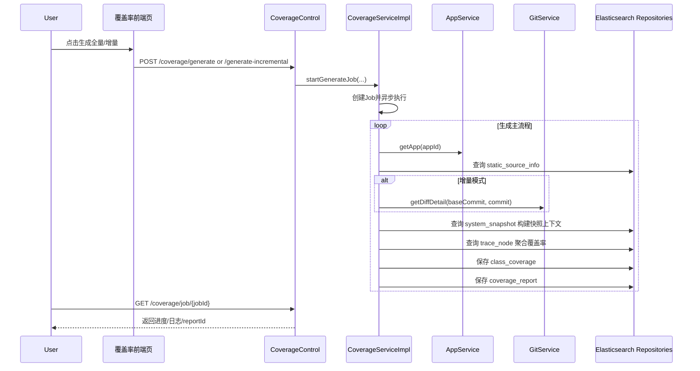

# oAT-service-web 覆盖率报告架构说明（管理视角 + 研发视角）

本文基于 `oAT-service-web` 现有实现，围绕覆盖率报告子域输出双视角架构图。

- 管理视角：业务、产品、应用、功能、信息
- 研发视角：系统、数据、技术、UML 类图、UML 时序图

关键代码参考：
- `oAT-service/oAT-service-web/src/main/java/com/oAT/web/control/CoverageControl.java`
- `oAT-service/oAT-service-web/src/main/java/com/oAT/web/service/CoverageService.java`
- `oAT-service/oAT-service-web/src/main/java/com/oAT/web/service/impl/CoverageServiceImpl.java`
- `oAT-service/oAT-service-web/src/main/java/com/oAT/web/esDao/entity/CoverageReportIndex.java`
- `oAT-service/oAT-service-web/src/main/java/com/oAT/web/esDao/entity/ClassCoverageIndex.java`
- `oAT-web-frontend` 覆盖率概览前端路由
- `oAT-web-frontend` 覆盖率详情前端路由
- `oAT-web-frontend` 覆盖率源码视图前端路由

---

## 一、管理视角

### 1) 业务架构图 - 覆盖率治理业务全景图

图目的：统一覆盖率报告在版本治理中的业务定位。

---

### 2) 产品架构图 - 覆盖率产品能力地图

图目的：描述用户在页面中的主路径与关键动作。

---

### 3) 应用架构图 - 应用覆盖率生命周期图

图目的：说明覆盖率域与其他业务域的边界和协作关系。

---

### 4) 功能架构图 - 覆盖率功能分解图

图目的：将覆盖率模块拆解为可管理、可迭代的能力树。

---

### 5) 信息架构图 - 覆盖率信息流与指标口径图

图目的：明确各页面展示信息来自哪些对象、指标如何串联。

---

## 二、研发视角

### 6) 系统架构图 - 覆盖率系统组件与边界图

图目的：展示控制层、服务层、存储层和外部系统的调用边界。

---

### 7) 数据架构图 - 覆盖率数据模型关系图

图目的：突出报告头与类明细的主从关系，以及快照/链路/静态源码的数据来源。

---

### 8) 技术架构图 - 覆盖率技术栈与执行链路图

图目的：说明覆盖率域的主要技术构件与依赖链路。

---

### 9) UML 类图 - Coverage 核心类关系图

图目的：给研发快速建立“入口-契约-实现-存储”的类关系认知。

---

### 10) UML 时序图 - 覆盖率报告生成时序图

图目的：帮助研发对齐异步任务、快照累计、落库过程的时序细节。

---

## 三、跨视角映射（管理层能力 -> 研发落地点）

| 管理视角关注点 | 研发落地点 |
|---|---|
| 生成全量/增量覆盖率 | `CoverageControl.generate*` + `CoverageServiceImpl.startJob/generateReportInternal` |
| 指标概览与趋势 | `CoverageReportIndex` + `CoverageServiceImpl.getTrendData` |
| 详情筛选与树视图 | `CoverageServiceImpl.getClassCoveragePage/getTreeNodes` |
| 源码着色洞察 | `CoverageServiceImpl.getColoredSource/applyColoring` |
| 数据时效与重生成 | `CoverageServiceImpl.hasNewerData/buildSnapshotCoverageContext` |

---

## 四、使用建议

- 管理评审：优先看“管理视角”5 张图。
- 技术评审：按“系统 -> 数据 -> 技术 -> UML”顺序讨论。
- 版本演进：每次覆盖率逻辑变更后，至少同步更新时序图与数据架构图。
