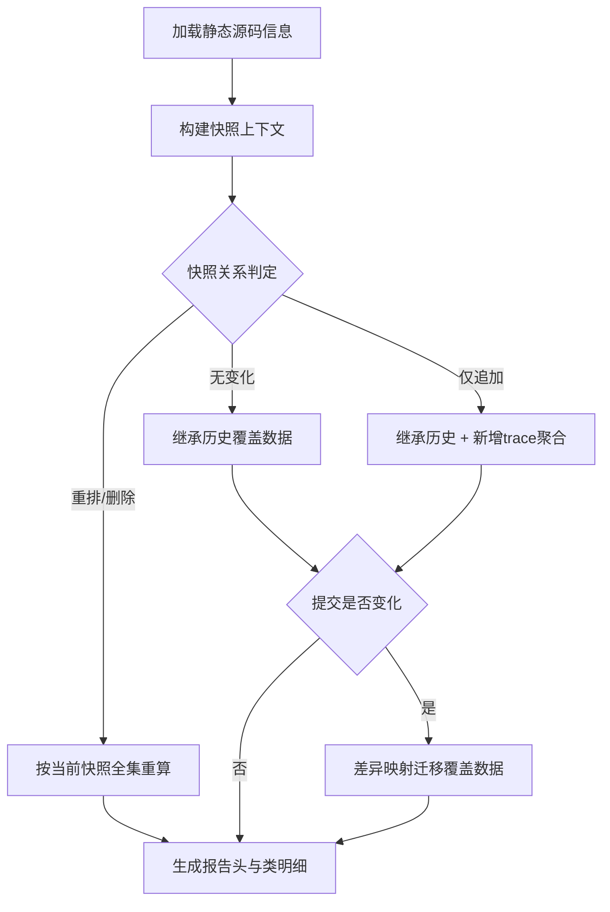

# P1-01 基于系统快照时间线的可继承覆盖率增量生成方法

- 状态：DRAFT
- 优先级：P1
- 风险：中
- 主要近似来源：通用架构（主）+ 行业常规（次）

## 1) 专利名称

一种面向系统快照时间线的可继承覆盖率增量生成方法。

## 2) 背景技术

- 在快照仅追加的工程场景下，现有覆盖率流程普遍采用全量重算，导致计算成本和等待时延偏高。
- 跨提交迭代时，历史报告复用机制不稳定，趋势口径易波动，难以支撑持续质量评审。
- 现有技术通常缺乏稳定的快照关系判定机制，以及从历史覆盖结果向新提交结果迁移的精细化路径。

## 3) 现有缺陷

- 缺乏稳定的快照变化模式判定机制。
- 缺乏从历史覆盖结果向新提交结果迁移的精细化路径。

## 4) 技术方案

- 构建目标版本的快照上下文与快照指纹。
- 判定快照关系模式：无变化、仅追加、重排/删除。
- 在可继承模式下复用历史类覆盖数据。
- 仅对新增 traceId 集合执行覆盖聚合。
- 提交变化时引入差异映射迁移有效覆盖并剔除失配项。
- 落库报告头与类覆盖明细，并同步输出全量与增量摘要指标。

### 变量及字段说明

- `totalLineNumbers` 表示方法静态总行号集合；`totalBranchCount` 表示方法全量分支数；`complexity` 表示方法复杂度。
- `effectiveTime` 表示快照生效时间；`snapshotIds` 表示快照标识序列；`traceIds` 表示追踪标识序列；`snapshotFingerprint` 表示快照序列指纹；`lastSnapshotTime` 表示最后一个快照时间；`traceCount` 表示 Trace 总数。
- `DiffMap` 表示提交差异映射；`className` 表示类全名；`methodName` 表示方法名；`methodDesc` 表示方法描述符；`changedLines` 表示类级变更行号集合。
- `coveredLineNumbers` 表示已覆盖行号集合；`coveredBranchIds` 表示已覆盖分支标识集合；`coveredLines` 表示已覆盖行数；`coveredBranches` 表示已覆盖分支数；`traceIdsToProcess` 表示本轮需要处理的 Trace 标识集合。
- `snapshotCount` 表示快照数量；`traceProcessed` 表示本轮实际处理的 Trace 数；`totalLines/coveredLines` 表示整体总行数/已覆盖行数；`incTotalLines/incCoveredLines` 表示增量总行数/增量已覆盖行数；`reportType` 表示报告类型；`MODE_APPEND_ONLY` 表示"仅追加快照"的继承模式；`methodReuseRatio` 表示方法级历史结果复用比例。

## 5) 本发明创造的优点、有益的技术效果

- 显著降低重算范围并缩短报告生成耗时。
- 提高跨版本覆盖率趋势的连续性与可解释性。
- 在提交变化场景下提升覆盖迁移准确度，减少人工核对成本。

## 6) 权利要求草案

### 独立权利要求1（一句话）

一种覆盖率生成方法，其特征在于：通过构建快照上下文并判定快照关系模式，在可继承模式下复用历史类覆盖结果并仅对新增链路执行增量聚合，且在提交变化时基于差异映射进行覆盖迁移后输出报告头与类明细。

### 从属权利要求2-5

- 权利要求2：根据权利要求1所述的方法，其特征在于，所述快照上下文包含按时间排序的快照标识序列、追踪标识序列、快照指纹和最后更新时间。
- 权利要求3：根据权利要求1所述的方法，其特征在于，当判定为仅追加模式时，仅对新增快照对应的追踪标识集合执行覆盖聚合。
- 权利要求4：根据权利要求1所述的方法，其特征在于，当提交标识变化时，基于提交差异映射对历史覆盖结果执行方法级迁移，并以变更行交集判定是否允许继承。
- 权利要求5：根据权利要求1所述的方法，其特征在于，输出结果至少包括报告头索引、类覆盖明细索引、快照上下文字段以及全量/增量双摘要指标。

### 技术关键点和欲保护点

- 技术关键点：快照关系模式判定、可继承覆盖复用、提交差异驱动迁移、最小化增量聚合、双摘要持久化。
- 欲保护点：以"快照时间线建模 -> 关系判定 -> 继承/重算分流 -> 差异迁移 -> 增量聚合 -> 报告输出"的流水化处理链，限定覆盖率增量生成的核心处理顺序与数据约束。

## 7) 发明内容

本方案由以下七个部件组成，各部件顺序衔接，共同完成"快照时间线建模、历史覆盖继承、增量聚合和报告输出"的全过程。

### 部件一：静态源码解析部件

**职责**：读取目标版本静态源码中的类、方法、行号、分支数与复杂度信息，建立本轮覆盖率计算的静态分母。

具体而言，该部件将源码解析为类覆盖对象和方法覆盖对象，并为每个方法预装 `totalLineNumbers`、`totalBranchCount`、`complexity` 等字段。数据上，例如某版本共解析出 `420` 个类、`5860` 个方法、`18400` 行有效代码，这些总量在后续继承、迁移和增量聚合过程中保持稳定，不会因 Trace 顺序变化而漂移。

### 部件二：快照上下文构建部件

**职责**：按版本收集有效快照并形成稳定时间线，为是否允许继承历史报告提供依据。

具体而言，该部件按 `effectiveTime` 升序组织 `snapshotIds` 和 `traceIds`，生成 `snapshotFingerprint` 与 `lastSnapshotTime`。数据上，例如历史报告时间线为 `[S101,S102,S103,S104,S105,S106,S107,S108]`，当前时间线为 `[S101,S102,S103,S104,S105,S106,S107,S108,S109,S110]`，并对应 `traceCount` 从 `236` 增至 `268`，则系统可直接识别当前仅新增了 `S109`、`S110` 两个快照。

### 部件三：模式判定部件

**职责**：判断当前快照时间线与候选历史报告之间属于"无变化""仅追加"还是"重排/删除"。

具体而言，该部件比较 `snapshotFingerprint`、`snapshotIds` 前缀关系和时间线顺序：若完全一致，则进入直接继承；若旧序列是新序列前缀，则进入仅追加增量；若存在中间删除、重排或插入，则转入全量重算。数据上，若当前 `268` 条 Trace 中仅有 `32` 条来自新增快照，则处理规模可被压缩到 `32/268≈11.9%`。

### 部件四：历史报告选择部件

**职责**：从同应用、同版本、同类型报告中选择最适合作为继承基线的历史报告。

具体而言，该部件按"同提交优先、同分支优先、最近生成优先"的顺序筛选候选报告，尽量让继承基线与当前请求最接近。数据上，例如同一版本下存在 `commitA`、`commitB`、`commitC` 三份历史报告，而本次目标提交为 `commitB`，则优先选择 `commitB` 对应报告，以减少后续迁移量。

### 部件五：覆盖继承迁移部件

**职责**：在可继承场景下复用历史覆盖事实，并在提交变化时按差异映射收敛到真正受影响的方法。

具体而言，该部件读取 `DiffMap[className]=changedLines`，以 `className + methodName + methodDesc` 作为方法身份，判断方法静态行号集合与 `changedLines` 是否相交。若不相交，则直接迁移 `coveredLineNumbers`、`coveredBranchIds`、`coveredLines`、`coveredBranches`；若相交，则取消继承资格，等待后续重新聚合。数据上，例如 `OrderService#create(OrderDTO)` 的行区间为 `145-173`，当差异行为 `{151,152,159,160}` 时该方法需要重算，而 `cancel(String)` 与 `list(Query)` 若与差异行无交集则可直接继承。

### 部件六：增量聚合部件

**职责**：仅对 `traceIdsToProcess` 对应的新增或需重算 Trace 执行覆盖累计。

具体而言，该部件逐条读取代码节点，将运行时执行行号并入 `coveredLineNumbers`，将分支执行事实并入 `coveredBranchIds`，并按类/方法唯一身份归并结果。数据上，若 `traceIdsToProcess=32`，平均每条 Trace 命中 `14` 个方法，则本轮原始运行时记录约 `448` 条，但最终可能只影响 `19` 个类、`61` 个方法。

### 部件七：报告持久化部件

**职责**：把静态分母、继承结果、增量聚合结果统一汇总为可查询、可比较的覆盖率报告。

具体而言，该部件写入报告头、类覆盖明细和全量/增量双摘要，至少包括 `snapshotCount`、`traceProcessed`、`totalLines/coveredLines`、`incTotalLines/incCoveredLines` 等字段。数据上，例如最终报告可同时给出 `totalLines=18400、coveredLines=13240` 和 `incTotalLines=980、incCoveredLines=712`，分别回答"整体覆盖如何"和"本次新增或变更部分覆盖如何"。

## 8) 具体实施例

### 实施例：订单应用在快照仅追加且提交发生变化时的覆盖率增量生成

某次报告生成请求的输入数据如下：

| 项目 | 数值 |
|---|---|
| 应用 | `app-order` |
| 版本号 | `2026.03.15` |
| 当前提交 | `commitB` |
| 历史报告提交 | `commitA` |
| 历史快照序列 | `[S101,S102,S103,S104,S105,S106,S107,S108]` |
| 当前快照序列 | `[S101,S102,S103,S104,S105,S106,S107,S108,S109,S110]` |
| 历史已处理 Trace 数 | `236` |
| 当前 Trace 总数 | `268` |
| 新增 Trace 数 | `32` |

按各部件执行后的处理过程如下：

1. **静态源码解析部件**先解析目标版本源码，得到 `420` 个类、`5860` 个方法和 `18400` 行有效代码，建立本轮报告的静态分母。
2. **快照上下文构建部件**生成 `snapshotCount=10`、`traceCount=268`、`lastSnapshotTime=2026-03-15 19:40:12`，并确认历史时间线是当前时间线的前缀。
3. **模式判定部件**据此把当前任务判定为 `MODE_APPEND_ONLY`，因此不需要重扫全部 `268` 条 Trace，只需处理新增的 `32` 条。
4. **历史报告选择部件**在同版本的历史报告中优先选中最接近的 `commitA` 报告作为继承基线。
5. **覆盖继承迁移部件**读取 `commitA -> commitB` 的差异映射，例如：
   - `com.demo.order.OrderService -> [151,152,159,160]`；
   - `com.demo.pay.PayFacade -> [88,89,90,91,92]`。  
   其中 `OrderService#create(OrderDTO)` 行区间 `145-173` 与差异行相交，取消继承；`cancel(String)` 行区间 `201-226` 和 `list(Query)` 行区间 `240-278` 与差异行无交集，直接迁移历史覆盖结果。
6. **增量聚合部件**仅对 `32` 条新增 Trace 和失去继承资格的方法对应执行记录做覆盖累计，把新增覆盖事实并入类/方法对象。
7. **报告持久化部件**输出最终摘要，示例如下：

```json
{
  "reportType": "FULL",
  "snapshotCount": 10,
  "traceProcessed": 32,
  "totalLines": 18400,
  "coveredLines": 13240,
  "incTotalLines": 980,
  "incCoveredLines": 712,
  "methodReuseRatio": "2/3"
}
```

本实施例中，系统没有因为新增快照和提交变化而对全部历史数据重算，而是先识别"仅追加"时间线，再把提交差异收敛到具体方法，最终把计算范围从 `268` 条 Trace 压缩到 `32` 条新增 Trace 与少量受影响方法，既保证了覆盖率趋势连续，又显著降低了重算成本。

### 效果图

图2：覆盖率增量生成报告效果示意

```
┌─────────────────────────────────────────────────────────────────────────────┐
│  覆盖率报告 - app-order v2026.03.15                                          │
├─────────────────────────────────────────────────────────────────────────────┤
│  报告类型: FULL          快照数: 10           处理Trace数: 32                │
├─────────────────────────────────────────────────────────────────────────────┤
│                                                                             │
│  ┌─────────────────────────────┐  ┌─────────────────────────────┐          │
│  │     全量覆盖指标             │  │     增量覆盖指标             │          │
│  │  ─────────────────────      │  │  ─────────────────────      │          │
│  │  总行数:     18,400         │  │  增量行数:     980           │          │
│  │  已覆盖行:   13,240 (72.0%) │  │  已覆盖行:     712 (72.7%)  │          │
│  │  总方法数:   5,860          │  │  增量方法数:   42            │          │
│  │  已覆盖方法: 4,128 (70.4%)  │  │  已覆盖方法:   29 (69.0%)   │          │
│  └─────────────────────────────┘  └─────────────────────────────┘          │
│                                                                             │
│  方法级继承统计                                                              │
│  ─────────────────────────────────────────────────────────────────────      │
│  可直接继承历史覆盖: 3,897 方法 (66.5%)                                      │
│  需重新聚合计算:     1,963 方法 (33.5%)                                      │
│  方法级复用比例:     2/3                                                    │
│                                                                             │
│  快照时间线继承关系                                                          │
│  ─────────────────────────────────────────────────────────────────────      │
│  [S101][S102][S103][S104][S105][S106][S107][S108] ← 历史已处理               │
│                                              [S109][S110] ← 本轮新增        │
│                                                                             │
│  提交差异映射影响                                                            │
│  ─────────────────────────────────────────────────────────────────────      │
│  OrderService#create(OrderDTO)    行145-173  ⚠ 需重算 (差异行相交)          │
│  OrderService#cancel(String)      行201-226  ✓ 继承 (无交集)                │
│  OrderService#list(Query)         行240-278  ✓ 继承 (无交集)                │
│  PayFacade#process(PayReq)        行88-92     ⚠ 需重算 (差异行相交)          │
│                                                                             │
└─────────────────────────────────────────────────────────────────────────────┘
```

## 9) 附图

以下附图为白色背景线条图（黑色线条）的流程示意，用于清晰表达本方案处理路径。

图1：覆盖率时间线继承与增量生成流程图（Mermaid）



## 10) 待补事项

### 必须补充

- 补充 1 组真实版本样本，记录 `snapshotCount`、`traceProcessed`、`coveredLines` 的前后对比值；
- 补充 1 组提交变化样本，统计"方法级可继承比例"和"重新聚合比例"。

### 可后补充

- 可补充"仅追加"与"全量重算"两种模式下的任务耗时对比；
- 可补充不同快照规模下的收益分桶数据，例如 `snapshotCount=10/50/100` 三档。
