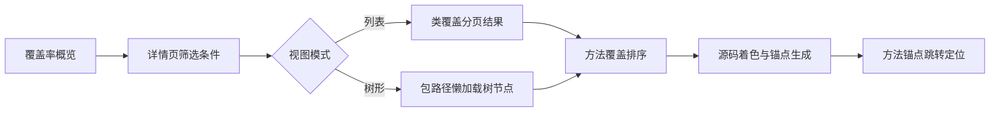

# P1-02 类-方法-源码锚点联动的覆盖率追溯展示方法

- 状态：DRAFT
- 优先级：P1
- 风险：中
- 主要近似来源：通用架构（主）+ 开源方案（次）

## 1) 专利名称

一种类-方法-源码锚点联动的覆盖率追溯展示方法。

## 2) 背景技术

- 现有覆盖率分析中，指标概览、明细列表与源码定位链路往往割裂，定位低覆盖根因效率低。
- 多条件筛选后，方法顺序与源码锚点顺序容易不一致，导致追溯误差与结果不稳定。
- 现有技术通常缺少“同一筛选语义贯穿查询、排序、着色、跳转”的统一机制。

## 3) 现有缺陷

- 列表视图与树视图缺少统一筛选模型。
- 方法排序与源码着色锚点缺乏稳定映射。

## 4) 技术方案

- 接收类名、方法名、覆盖率区间与复杂度区间等组合过滤条件。
- 提供列表模式与树形懒加载模式。
- 对方法覆盖明细按稳定规则排序后生成锚点。
- 基于锚点对源码执行行级着色并建立跳转关系。
- 在同一上下文中输出概览、详情、源码联动数据。

### 变量及字段说明

- `lineRateMin/Max`、`branchRateMin/Max`、`methodRateMin/Max` 分别表示行覆盖率、分支覆盖率、方法覆盖率的筛选下限/上限；`complexityMin/Max` 表示复杂度筛选下限/上限。
- `versionToken` 表示同一轮筛选上下文的版本令牌；`mode` 表示视图模式，其中 `LIST` 表示分页列表模式，`TREE` 表示树形懒加载模式。
- `methodRate` 表示方法覆盖率；`branchRate` 表示分支覆盖率；`lineRate` 表示行覆盖率；`methodSignature` 表示方法签名；`coveredLineNumbers` 表示已覆盖行号集合；`totalLineNumbers` 表示静态总行号集合。
- `className` 表示类全名；`startLine`、`endLine` 表示方法源码起止行；`anchor_i` 表示第 `i` 个方法锚点标识；`anchor` 表示返回给页面的锚点值。
- `reportId` 表示覆盖率报告标识；`classNameLike`、`methodNameLike` 表示类名/方法名模糊匹配条件；`pageNo`、`pageSize` 表示分页页码与页大小；`overview.classCount` 表示概览中的类数量；`lowCoverageMethodCount` 表示低覆盖方法数量；`jumpTargets` 表示可跳转源码目标数量。

## 5) 本发明创造的优点、有益的技术效果

- 缩短“发现低覆盖问题 -> 定位具体代码”的路径。
- 提升追溯结果一致性与分析可信度。
- 降低跨页面上下文切换成本，提升排障效率。

## 6) 权利要求草案

### 独立权利要求1（一句话）

一种覆盖率追溯展示方法，其特征在于：通过统一筛选参数驱动列表与树形懒加载，并依据方法覆盖排序生成源码锚点着色映射，实现指标视图与源码视图的一致联动追溯。

### 从属权利要求2-5

- 权利要求2：根据权利要求1所述的方法，其特征在于，筛选参数至少包括类名、方法名、行覆盖率区间、分支覆盖率区间、方法覆盖率区间与复杂度区间。
- 权利要求3：根据权利要求1所述的方法，其特征在于，树形懒加载基于包路径前缀逐层返回包节点与类节点。
- 权利要求4：根据权利要求1所述的方法，其特征在于，方法覆盖明细按预设排序规则生成源码锚点并维持与方法列表一致顺序。
- 权利要求5：根据权利要求1所述的方法，其特征在于，源码视图基于覆盖状态对行号执行颜色标记并支持锚点跳转定位。

### 技术关键点和欲保护点

- 技术关键点：统一筛选参数模型、列表/树双视图联动、方法排序与源码锚点稳定映射、行级着色跳转。
- 欲保护点：以统一筛选语义驱动“查询组织 -> 方法排序 -> 源码着色 -> 锚点定位”的全链路联动机制。

## 7) 发明内容

本方案由以下六个部件组成，各部件顺序衔接，共同完成覆盖率结果从类级筛选到源码定位的联动追溯。

### 部件一：条件筛选部件

**职责**：接收类名、方法名、覆盖率区间、复杂度区间等参数，并把不同入口的筛选条件标准化为统一语义。

具体而言，该部件对 `lineRateMin/Max`、`branchRateMin/Max`、`methodRateMin/Max`、`complexityMin/Max` 执行空值补齐、边界修正和模式校验，同时生成 `versionToken`，确保列表、树和源码页共享同一筛选上下文。数据上，例如输入 `lineRateMin=0、lineRateMax=80、mode=LIST` 时，该部件会把请求标准化为可复用的统一筛选对象。

### 部件二：结果组织部件

**职责**：在统一筛选语义下组织类级候选结果，并根据模式输出分页列表或树形懒加载节点。

具体而言，该部件先基于类名、方法名存在性、覆盖率区间和复杂度区间构建候选类集合，再按 `LIST` 或 `TREE` 两种模式组织输出。数据上，例如 `mode=LIST` 时可返回当前页 `20` 个类；`mode=TREE` 时可只返回前缀 `com.demo` 下的当前层包节点和类节点，避免一次性加载全量结构。

### 部件三：方法排序部件

**职责**：对目标类的方法覆盖明细按稳定规则排序，生成跨视图一致的方法顺序。

具体而言，该部件优选按照 `methodRate asc, branchRate asc, lineRate asc, complexity desc, methodSignature asc` 计算排序键，把低覆盖、高复杂度的方法排在前面。数据上，例如某类中的 `create(OrderDTO)`、`createBatch(List<OrderDTO>)`、`createWithRetry(OrderDTO,int)` 可依次得到 `42%`、`51%`、`63%` 的方法覆盖率，并据此形成稳定顺序。

### 部件四：源码着色部件

**职责**：根据方法覆盖状态对源码逐行着色，直接呈现已覆盖与未覆盖区域。

具体而言，该部件依据 `coveredLineNumbers` 和 `totalLineNumbers` 把源码行标记为“已覆盖”“未覆盖”或“部分覆盖”，并确保着色顺序与方法排序结果保持一致。数据上，例如某次渲染可对 `147` 行源码完成着色统计，并把其中 `27` 个跳转目标对应的方法首行保留下来。

### 部件五：锚点映射部件

**职责**：为排序后的每个方法生成唯一锚点，并维护方法到源码区间的稳定映射。

具体而言，该部件根据 `className`、`methodSignature`、`startLine`、`endLine` 生成 `anchor_i`，并建立 `anchor_i -> (className,startLine,endLine,methodSignature)` 的映射。数据上，例如 `create(OrderDTO)` 可形成 `anchor_1 -> (com.demo.order.OrderService, 134, 176, create(com.demo.dto.OrderDTO):com.demo.order.Order)`，从而解决重载方法消歧和多次刷新顺序漂移问题。

### 部件六：页面联动部件

**职责**：把概览、详情和源码三层结果串联为同一追溯链路，用户从任一入口均可落到一致的源码位置。

具体而言，该部件消费列表或树中的类结果、方法排序结果、锚点映射和源码着色结果，形成“类选择 -> 方法定位 -> 源码跳转”的联动页面。数据上，例如一次查询可同时返回 `overview.classCount=12`、`lowCoverageMethodCount=27`、`jumpTargets=27` 等结果，页面不需要再做二次拼装。

## 8) 具体实施例

### 实施例：列表模式下的低覆盖方法追溯

某次覆盖率追溯请求的输入数据如下：

```json
{
  "reportId": "R20260311",
  "classNameLike": "OrderService",
  "methodNameLike": "create",
  "lineRateMin": 0,
  "lineRateMax": 80,
  "branchRateMin": 0,
  "branchRateMax": 70,
  "methodRateMin": 0,
  "methodRateMax": 100,
  "complexityMin": 1,
  "complexityMax": 30,
  "mode": "LIST",
  "pageNo": 1,
  "pageSize": 20
}
```

按各部件执行后的处理过程如下：

1. **条件筛选部件**对输入参数进行标准化，生成统一筛选对象和 `versionToken=t_101`。
2. **结果组织部件**基于报告 `R20260311` 构建候选类集合，并在 `LIST` 模式下返回分页结果。此时概览层得到 `classCount=12`，其中包含 `com.demo.order.OrderService`。
3. **方法排序部件**加载 `OrderService` 的方法覆盖明细，并按稳定排序规则得到如下前三个方法：

| 排序序号 | 方法签名 | methodRate | branchRate | lineRate | complexity |
|---|---|---:|---:|---:|---:|
| 1 | `create(OrderDTO)` | 42% | 35% | 48% | 18 |
| 2 | `createBatch(List<OrderDTO>)` | 51% | 40% | 56% | 22 |
| 3 | `createWithRetry(OrderDTO,int)` | 63% | 58% | 66% | 26 |

4. **源码着色部件**对 `OrderService` 源码第 `134-279` 行执行着色，统计得到 `coloredLines=147`。
5. **锚点映射部件**为排序后的方法生成 `anchor_1`、`anchor_2`、`anchor_3`，其中 `anchor_1 -> (com.demo.order.OrderService, 134, 176, create(com.demo.dto.OrderDTO):com.demo.order.Order)`。
6. **页面联动部件**把分页结果、方法排序、源码着色和锚点映射统一输出，结果示例如下：

```json
{
  "overview": {"classCount": 12, "lowCoverageMethodCount": 27},
  "details": [
    {"anchor": "anchor_1", "method": "create(OrderDTO)", "startLine": 134, "endLine": 176},
    {"anchor": "anchor_2", "method": "createBatch(List<OrderDTO>)", "startLine": 178, "endLine": 241}
  ],
  "codeView": {"coloredLines": 147, "jumpTargets": 27}
}
```

本实施例中，系统先保证列表、排序、着色和锚点共享同一筛选语义，再把低覆盖方法顺序与源码区间严格绑定，因此用户从详情页点击 `create(OrderDTO)` 时，总能稳定跳到 `134-176` 行，而不会出现列表顺序与源码锚点错位的问题。

### 效果图

图2：覆盖率追溯联动展示效果示意

```
┌─────────────────────────────────────────────────────────────────────────────────────┐
│  覆盖率追溯 - 报告 R20260311                                    筛选条件 ▼    │
├─────────────────────────────────────────────────────────────────────────────────────┤
│                                                                                     │
│  ┌─ 概览 ─────────────────────────────────────────────────────────────────────┐    │
│  │  命中类数: 12      低覆盖方法数: 27      可跳转目标: 27                     │    │
│  └─────────────────────────────────────────────────────────────────────────────┘    │
│                                                                                     │
│  ┌─ 方法覆盖明细 ─────────────────────────────────────────────────────────────┐    │
│  │ 序号 │ 方法签名                  │ 方法覆盖率 │ 行覆盖率 │ 分支覆盖率 │ 复杂度 │    │
│  ├──────┼───────────────────────────┼────────────┼──────────┼────────────┼────────┤    │
│  │  1   │ create(OrderDTO)          │   42% ⚠    │   48%    │    35%     │   18   │    │
│  │  2   │ createBatch(List<...>)    │   51% ⚠    │   56%    │    40%     │   22   │    │
│  │  3   │ createWithRetry(...)      │   63%      │   66%    │    58%     │   26   │    │
│  └─────────────────────────────────────────────────────────────────────────────┘    │
│                                                                                     │
│  ┌─ 源码视图 - OrderService.java ─────────────────────────────────────────────┐    │
│  │                                                        跳转: [anchor_1]    │    │
│  │  134 │  public Order create(OrderDTO dto) {               ◀─ 方法入口     │    │
│  │  135 │      validateOrder(dto);                  ░░░░░░░ 未覆盖          │    │
│  │  136 │      Order order = new Order();           ████████ 已覆盖          │    │
│  │  137 │      order.setUserId(dto.getUserId());    ████████ 已覆盖          │    │
│  │  ...│      ...                                                             │    │
│  │  145 │      if (dto.isPriority()) {              ░░░░░░░ 未覆盖          │    │
│  │  146 │          return priorityCreate(order);    ░░░░░░░ 未覆盖          │    │
│  │  147 │      }                                    ░░░░░░░ 未覆盖          │    │
│  │  ...│      ...                                                             │    │
│  │  176 │  }                                                                  │    │
│  └─────────────────────────────────────────────────────────────────────────────┘    │
│                                                                                     │
│  图例: ████████ 已覆盖   ░░░░░░░ 未覆盖   ⚠ 低覆盖告警                            │
│                                                                                     │
└─────────────────────────────────────────────────────────────────────────────────────┘
```

## 9) 附图

以下附图为白色背景线条图（黑色线条）的流程示意，用于清晰表达本方案结果与处理路径。

图1：覆盖率追溯联动流程图（Mermaid）



## 10) 待补事项

### 必须补充

- 方法排序规则示例数据：已在实施例A、实施例C中补充，可继续补充更多行业样本
- 建议补充一组列表模式与树形模式使用同一筛选条件得到一致类结果的对照数据

### 可后补充

- 大数据量场景交互耗时数据：TODO
- 并发切换筛选条件时 `versionToken` 去旧保新效果的压测数据：TODO
