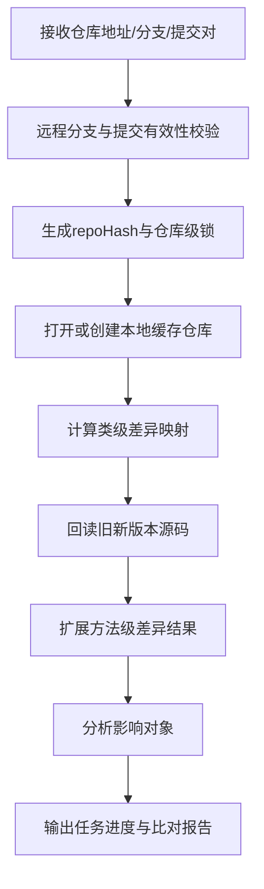

# P1-03 基于远程校验、仓库级串行化与提交对复用的 Git 比对任务编排方法

- 状态：DRAFT
- 优先级：P1
- 风险：中
- 主要近似来源：开源方案（主）+ 通用架构（次）

## 1) 专利名称

一种基于远程校验、仓库级串行化与提交对复用的 Git 比对任务编排方法。

## 2) 背景技术

- 版本比对任务通常涉及远程仓库校验、仓库拉取、提交差异计算、方法级影响识别和报告落库等多个阶段，若缺少统一编排，容易出现重复拉取、重复计算和任务互相争抢的问题。
- 现有方案常把“Git 可达性校验”“差异计算”“影响分析”拆散处理，导致用户发起任务后只能得到粗粒度成功/失败结果，难以定位卡点。
- 在同一仓库被多个任务并发访问时，若没有仓库级串行化控制，容易造成本地缓存目录冲突、拉取状态不一致和比对结果不稳定。
- 现有技术普遍缺少“远程有效性校验 -> 仓库级锁 -> 本地仓库复用 -> 提交对差异映射 -> 方法级影响扩展 -> 结构化落库”的一体化任务编排机制。

## 3) 现有缺陷

- 分支存在性、提交可达性与本地仓库状态没有统一前置校验模型。
- 同一仓库的并发比对任务缺少稳定串行化控制。
- 差异结果往往只停留在文件级，难以直接支撑方法级影响分析和后续报告复用。
- 任务进度、阶段日志、结果摘要缺少统一输出，排障成本高。

## 4) 技术方案

- 接收仓库地址、认证信息、分支、旧提交、新提交、包范围和任务标识等输入参数。
- 先执行远程分支存在性校验与提交可达性校验，过滤无效任务。
- 以仓库地址哈希生成仓库级锁，对同一仓库的并发任务进行串行化处理。
- 复用本地 Git 缓存目录，在对象缺失时增量 `fetch`，避免每次重复 `clone`。
- 基于提交对构建“类名 -> 变更行集合”的差异映射，并进一步扩展为方法级增删改结果。
- 采用异步任务模型输出阶段状态、进度、日志和结构化结果。
- 将差异结果统一复用于版本比对报告、受影响对象分析和后续覆盖率关联分析。

### 变量及字段说明

- `branch` 表示目标分支名；`refs/heads/{branch}` 表示远程分支引用路径；`oldCommit`、`newCommit` 表示待比较的旧提交与新提交；`branchFound` 表示分支是否存在；`dryRunFetchPassed` 表示远程可达性校验是否通过。
- `repoUrl` 表示仓库地址；`repoHash` 表示仓库地址的哈希值；`repoLockKey` 表示仓库级锁标识；`repoDir` 表示本地仓库缓存目录；`diffKey` 表示提交对差异结果复用键。
- `D_class` 表示类级差异映射；`className` 表示类全名；`changeType` 表示变更类型；`originalPath` 表示源码原始路径；`changedLines` 表示变更行号集合；`startLine`、`endLine`、`bodyText` 分别表示方法起始行、结束行和方法体文本。
- `progressName` 表示当前阶段名称；`progressValue` 表示当前阶段进度值；`jobLog` 表示阶段日志；`finish` 表示任务是否结束；`errorMessage` 表示异常信息。
- `gitBranch`、`gitOldCommit`、`gitNewCommit` 分别表示落库结果中的分支名、旧提交、新提交；`addClassCount`、`updateMethodCount`、`impactTargetCount`、`diffClassCount`、`diffMethodCount` 表示差异统计项；`cacheHit` 表示本次是否命中本地仓库或差异缓存。

## 5) 本发明创造的优点、有益的技术效果

- 将仓库校验、拉取、比对、分析、落库组织为稳定流水线，减少任务失败与重复计算。
- 通过仓库级串行化和本地仓库复用，降低并发场景下的 I/O 与网络开销。
- 将提交对差异从类级扩展到方法级，提升版本影响分析的可解释性。
- 通过阶段化进度和结构化日志输出，提升任务可观测性与排障效率。

## 6) 权利要求草案

### 独立权利要求1（一句话）

一种 Git 比对任务编排方法，其特征在于：在比对任务执行前完成远程分支与提交有效性校验，并以仓库地址生成仓库级串行化控制，在复用本地仓库缓存的基础上构建提交对差异映射，再扩展为方法级影响对象并以异步任务方式输出结构化结果。

### 从属权利要求2-5

- 权利要求2：根据权利要求1所述的方法，其特征在于，远程有效性校验至少包括分支引用存在性校验和提交对象可达性校验。
- 权利要求3：根据权利要求1所述的方法，其特征在于，同一仓库地址通过哈希转换为统一锁标识，以限制并发任务对同一本地仓库目录的竞争访问。
- 权利要求4：根据权利要求1所述的方法，其特征在于，提交对差异映射至少包含类名、原始路径、变更类型和变更行号集合。
- 权利要求5：根据权利要求1所述的方法，其特征在于，异步任务生命周期至少输出阶段名称、阶段进度、日志内容和差异统计摘要。

### 技术关键点和欲保护点

- 技术关键点：远程有效性校验、仓库级锁、本地仓库复用、提交对差异映射、方法级影响定位、异步阶段编排。
- 欲保护点：以“远程校验 -> 仓库级串行化 -> 本地仓库复用 -> 提交对差异映射 -> 方法级影响扩展 -> 任务阶段输出”的处理链保护版本比对任务编排核心机制。

## 7) 发明内容

本方案由以下八个部件组成，各部件顺序衔接，共同完成从仓库有效性校验到结构化比对结果落库的任务编排过程。

### 部件一：远程校验部件

**职责**：在真正执行差异计算前，确认目标分支存在且旧提交、新提交在远端可达。

具体而言，该部件优先校验 `refs/heads/{branch}` 是否存在，再验证 `oldCommit` 和 `newCommit` 是否可解析，避免无效任务进入仓库准备和差异计算阶段。数据上，例如 `branch=release/1.2`、`newCommit=8f3a2c1` 时，若 `branchFound=true` 且 `dryRunFetchPassed=true`，则任务可以继续执行。

### 部件二：端点标准化部件

**职责**：把仓库地址、提交对、包范围和任务上下文统一封装为稳定比较请求。

具体而言，该部件构建 `repoHash`、`repoLockKey`、`repoDir`、`diffKey` 和阶段集合，使后续锁控制、仓库复用、差异复用围绕同一组标识工作。数据上，例如 `repoUrl=https://git.example.com/order.git` 时，可生成 `repoHash=6f3a...`、`repoLockKey=repo:lock:repo:6f3a...`、`repoDir=/data/gitCacheRoot/6f3a...`。

### 部件三：仓库锁定部件

**职责**：以仓库地址哈希为粒度对同一仓库的并发任务进行串行化控制。

具体而言，该部件在任务进入本地仓库目录前先申请 `repoLockKey`，保证同一时刻只有一个任务修改同一 `repoDir`。数据上，例如两个任务同时访问同一 `repoUrl` 时，它们会生成相同的 `repoLockKey`，后到任务必须等待先到任务释放锁，避免目录竞争和对象状态冲突。

### 部件四：仓库复用部件

**职责**：优先复用已有本地仓库，只在对象缺失时增量 `fetch`，减少重复 `clone` 成本。

具体而言，该部件先检查 `repoDir` 是否存在，若存在则直接打开本地仓库；若目标对象缺失，再定向补齐提交对象；仅在本地仓库完全不存在时才执行首次克隆。数据上，若任务1已创建好 `repoDir`，则任务2进入时通常只需做对象解析或少量增量拉取。

### 部件五：差异构建部件

**职责**：把提交对差异从文件级文本变化转换为类级 `D_class` 映射。

具体而言，该部件逐 hunk 提取 `.java` 文件的新版本侧变更行号，生成 `D_class[className]=(changeType, originalPath, changedLines)`。数据上，例如 `src/main/java/com/demo/order/OrderService.java` 的 edit 区间为 `57-58`、`60`、`84` 时，可输出 `className=com.demo.order.OrderService`、`changeType=MODIFY`、`changedLines=[57,58,60,84]`。

### 部件六：方法扩展部件

**职责**：在类级差异基础上回读旧/新版本源码，继续收敛到方法级增删改结果。

具体而言，该部件解析旧/新源码的 `startLine`、`endLine` 和 `bodyText`，按“方法名 + 行区间 + 文本变化”判断方法的新增、删除或更新。数据上，例如 `createOrder(OrderReq)` 行区间为 `118-146`，若与 `changedLines=[120,121,135]` 相交且 `bodyChanged=true`，则该方法被标记为 `update`。

### 部件七：任务编排部件

**职责**：把远程校验、仓库复用、差异构建、方法扩展和影响分析组织为可观测的异步任务链路。

具体而言，该部件按阶段输出 `progressName`、`progressValue`、`jobLog`、`finish` 和 `errorMessage`，让调用方实时感知任务卡在哪个阶段。数据上，例如“获取 Git 差异”阶段可输出 `progressValue=50`，进入“分析影响对象”阶段后再从 `62` 推进到 `80`。

### 部件八：结果持久化部件

**职责**：把类级差异、方法级差异、影响对象和阶段摘要统一落库存档。

具体而言，该部件至少保存 `gitBranch`、`gitOldCommit`、`gitNewCommit`、`addClassCount`、`updateMethodCount`、`impactTargetCount` 等字段，供版本报告、受影响分析和覆盖率关联链路继续复用。数据上，例如一次任务可最终产出 `diffClassCount=13`、`diffMethodCount=29`、`impactTargetCount=12` 的结构化结果。

## 8) 具体实施例

### 实施例：同仓库并发任务下的 Git 比对编排

某次并发比对请求的输入数据如下：

| 项目 | 任务1 | 任务2 |
|---|---|---|
| 仓库地址 | `https://git.example.com/order.git` | `https://git.example.com/order.git` |
| 分支 | `release/1.2` | `release/1.2` |
| 提交对 | `commitA -> commitB` | `commitB -> commitC` |
| 包范围 | `com.demo.order` | `com.demo.order` |

按各部件执行后的处理过程如下：

1. **远程校验部件**分别校验两个任务的分支和提交可达性，确认 `branchFound=true`、两个提交对均可解析。
2. **端点标准化部件**为两个任务生成相同的 `repoHash=6f3a...`、`repoLockKey=repo:lock:repo:6f3a...` 和 `repoDir=/data/gitCacheRoot/6f3a...`。
3. **仓库锁定部件**先让任务1取得仓库级锁，任务2进入等待队列，避免同时操作同一仓库目录。
4. **仓库复用部件**发现任务1是首次执行，因此初始化 `repoDir`；任务2在锁释放后直接复用已存在仓库，仅补齐缺失对象。
5. **差异构建部件**对任务1输出 `diffClassCount=13`，对任务2输出 `diffClassCount=7`，并为每个类生成 `changedLines`。
6. **方法扩展部件**继续把类级差异收敛为方法级结果，任务1得到 `diffMethodCount=29`，任务2得到 `diffMethodCount=15`。
7. **任务编排部件**全过程输出阶段进度和日志，例如任务1在“获取 Git 差异”结束时输出 `progressValue=50`，进入“分析影响对象”后继续推进。
8. **结果持久化部件**统一落库，生成如下摘要：

| 任务 | repoHash | cacheHit | diffClassCount | diffMethodCount | impactTargetCount | 说明 |
|---|---|---:|---:|---:|---:|---|
| 任务1 | `6f3a...` | 0 | 13 | 29 | 12 | 首次初始化仓库 |
| 任务2 | `6f3a...` | 1 | 7 | 15 | 6 | 复用仓库，仅补齐缺失对象 |

本实施例中，系统先对无效端点做前置拦截，再用仓库级锁保证同仓库任务串行化，随后把类级 diff 继续细化到方法级影响对象，并通过阶段化输出让调用方实时感知进度。这样既降低了并发任务对仓库目录的冲突概率，又显著提高了比对结果的可解释性和复用价值。

### 效果图

图2：Git 比对任务编排进度与结果效果示意

```
┌─────────────────────────────────────────────────────────────────────────────────────┐
│  Git 比对任务                                                  任务ID: T-001   │
├─────────────────────────────────────────────────────────────────────────────────────┤
│                                                                                     │
│  任务配置                                                                           │
│  ─────────────────────────────────────────────────────────────────────────────      │
│  仓库: https://git.example.com/order.git    分支: release/1.2                      │
│  提交对: commitA → commitB                  包范围: com.demo.order                  │
│                                                                                     │
│  执行进度                                                                           │
│  ─────────────────────────────────────────────────────────────────────────────      │
│  ├─ ✓ 远程校验          ████████████████████ 100%  (0.8s)                          │
│  ├─ ✓ 仓库锁定          ████████████████████ 100%  (0.1s)  [复用本地仓库]           │
│  ├─ ✓ 获取Git差异       ████████████████████ 100%  (1.2s)                          │
│  ├─ ✓ 解析类级差异      ████████████████████ 100%  (0.5s)                          │
│  ├─ ✓ 扩展方法级影响    ████████████████████ 100%  (0.8s)                          │
│  └─ ✓ 结果持久化        ████████████████████ 100%  (0.3s)                          │
│                                                                                     │
│  ┌─ 比对结果摘要 ─────────────────────────────────────────────────────────────┐    │
│  │                                                                            │    │
│  │  仓库缓存命中: ✓ (repoHash: 6f3a...)                                       │    │
│  │  差异类数量:    13 类                                                      │    │
│  │  差异方法数量:  29 方法                                                    │    │
│  │  影响对象数量:  12 个                                                      │    │
│  │                                                                            │    │
│  │  方法级变更分布:                                                           │    │
│  │  ├── 新增方法:  4 个                                                       │    │
│  │  ├── 删除方法:  2 个                                                       │    │
│  │  └── 修改方法:  23 个                                                      │    │
│  └────────────────────────────────────────────────────────────────────────────┘    │
│                                                                                     │
│  总耗时: 3.7s                                          状态: ✓ 成功                 │
│                                                                                     │
└─────────────────────────────────────────────────────────────────────────────────────┘
```

## 9) 附图

以下附图为白色背景线条图（黑色线条）的流程示意，用于清晰表达本方案处理路径。

图1：Git 比对任务编排流程图（Mermaid）



## 10) 待补事项

### 必须补充

- 补充 1 组真实任务样本，记录 `cacheHit`、`diffClassCount`、`diffMethodCount` 和任务总耗时；
- 补充 1 组并发任务样本，记录仓库级锁生效前后的失败率或冲突率对比。

### 可后补充

- 可补充不同仓库规模下的复用收益分桶数据；
- 可补充方法级影响对象与最终受影响用例数量之间的对应关系样本。
