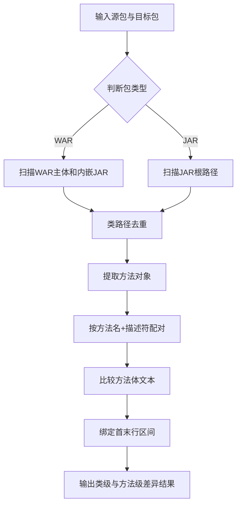

# P2-01 基于字节码方法体与行号区间的 WAR/JAR 差异识别方法

- 状态：DRAFT
- 优先级：P2
- 风险：中
- 主要近似来源：开源方案（主）+ 行业常规（次）

## 1) 专利名称

一种基于字节码方法体与行号区间的 WAR/JAR 差异识别方法。

## 2) 背景技术

- 版本包比对若仅停留在文件级，无法回答"哪个方法真正发生变化"。
- 仅输出类名而不输出方法行号区间，难以继续支撑评审、影响分析和回归定位。
- 在 WAR 场景中，类既可能位于主包目录，也可能位于内嵌 JAR 中，若扫描不完整则差异结果失真。
- 在 JAR 场景中，类直接位于包根路径下，扫描方式与 WAR 不同，需要统一处理入口。

## 3) 现有缺陷

- 同名方法缺少稳定配对规则，容易误报或漏报。
- WAR 主体与内嵌 JAR 的 class 提取常分为两套逻辑，结果口径不一致。
- 方法级变化缺少结构化输出，不利于下游复用。

## 4) 技术方案

- 同时扫描 WAR 主体和内嵌 JAR 中的 class 字节码，或直接扫描独立 JAR 包。
- 以类路径为统一标识执行类级去重。
- 通过 ASM 提取方法名、描述符、方法体文本和首末行号。
- 以"方法名 + 描述符"配对同名方法，并比较方法体文本判定增删改。
- 输出类级和方法级差异结果，并附带 `firstLine-lastLine` 行号区间。

### 变量及字段说明

- `nestedJarCount` 表示内嵌 JAR 数量；`rawClassCount` 表示原始抽取的 class 条目数；`dedupClassCount` 表示按类路径去重后的 class 数量。
- `methodName` 表示方法名；`methodDesc` 表示方法描述符；`bodyText` 表示方法体文本；`firstLine`、`lastLine` 表示方法源码起止行；`bodyTextLength` 表示方法体文本长度；`lineRange` 表示方法行号区间。
- `className` 表示类全名；`classModel` 表示类级差异类型；`methodModel` 表示方法级差异类型。
- `addClassCount`、`updateClassCount`、`deleteClassCount` 分别表示新增类、更新类、删除类数量；`addMethodCount`、`updateMethodCount`、`deleteMethodCount` 分别表示新增方法、更新方法、删除方法数量。

## 5) 本发明创造的优点、有益的技术效果

- 将版本包差异从文件级收敛到方法级。
- 提供可直接复用于评审和影响分析的结构化差异对象。
- 保证 WAR 与内嵌 JAR 的扫描口径一致，提升差异识别完整性。

## 6) 权利要求草案

### 独立权利要求1（一句话）

一种程序包差异识别方法，其特征在于：对源包和目标包中的 WAR 主体与内嵌 JAR，或独立 JAR 包统一提取 class 字节码，经类级去重后以方法名和描述符匹配方法对象，并通过方法体文本比较和行号区间提取输出类级与方法级差异结果。

### 从属权利要求2-5

- 权利要求2：根据权利要求1所述的方法，其特征在于，所述方法对象至少包含方法名、描述符、方法体文本、首行号和末行号。
- 权利要求3：根据权利要求1所述的方法，其特征在于，所述程序包扫描范围包括 WAR 主体目录、内嵌 JAR 文件或独立 JAR 包。
- 权利要求4：根据权利要求1所述的方法，其特征在于，所述方法级差异至少区分新增、删除和更新三类。
- 权利要求5：根据权利要求1所述的方法，其特征在于，差异输出对象同时记录类名和方法行号区间。

### 技术关键点和欲保护点

- 技术关键点：双路径 class 提取（WAR 主体 + 内嵌 JAR）或单路径提取（独立 JAR）、类级去重、方法签名配对、字节码方法体比较、行号区间输出。
- 欲保护点：以"统一扫描 -> 类级去重 -> 方法配对 -> 方法体比较 -> 行号区间输出"的处理链保护程序包差异识别核心机制，其中统一扫描覆盖 WAR 和 JAR 两种包形态。

## 7) 发明内容

本方案由以下六个部件组成，各部件顺序衔接，共同完成从程序包扫描到方法级差异结果输出的全过程。

### 部件一：程序包扫描部件

**职责**：同时扫描源包和目标包中的 WAR 主体目录及内嵌 JAR，或直接扫描独立 JAR 包，提取可比较的 class 字节码集合。

具体而言，该部件针对不同包形态采用差异化扫描策略：对于 WAR 包，覆盖 `BOOT-INF/classes/`、`WEB-INF/classes/` 以及 WAR 内嵌 `*.jar` 三类来源；对于独立 JAR 包，直接扫描包根路径下的 class 文件。数据上，例如一次比对中 `nestedJarCount=27`，原始抽出的 class 条目数为 `342`，该部件先保证这些 class 不会因存放位置不同而漏扫；若输入为独立 JAR 包，则直接从根路径提取 class。

### 部件二：类归一部件

**职责**：把不同来源抽取出的 class 条目按类路径归并为统一类集合，消除重复对象。

具体而言，该部件以类全路径作为唯一标识，对 WAR 主体和内嵌 JAR 中的重复类执行去重，形成后续方法比较的稳定输入。数据上，若 `rawClassCount=342`，去重后得到 `dedupClassCount=318`，则说明有 `24` 个重复条目被消除，后续差异结果只围绕 `318` 个唯一路径类对象展开。

### 部件三：方法解析部件

**职责**：从去重后的每个 class 中提取方法对象，形成方法级可比较单元。

具体而言，该部件通过 ASM 提取 `methodName`、`methodDesc`、`bodyText`、`firstLine`、`lastLine` 等字段。数据上，例如 `createOrder(OrderReq)` 可被解析为 `methodDesc=(Lcom/demo/dto/OrderReq;)Ljava/lang/String;`，行号区间为 `128-167`，这组数据既能用于方法配对，也能直接给评审环节做源码定位。

### 部件四：方法比较部件

**职责**：按"方法名 + 描述符"匹配源版本和目标版本方法，并判定新增、删除或更新。

具体而言，该部件先完成同签名方法配对，再比较两侧 `bodyText` 是否变化：仅出现在目标版本的方法记为新增，仅出现在源版本的方法记为删除，两侧都存在但方法体不同的方法记为更新。数据上，若 `createOrder(OrderReq)` 在两侧都存在，但 `bodyTextLength` 由 `420` 变为 `468`，则该方法被标记为 `update`。

### 部件五：行号绑定部件

**职责**：把方法差异结果与 `firstLine-lastLine` 行号区间绑定输出，形成可直接审阅的定位证据。

具体而言，该部件在生成方法级结论的同时记录源码首末行区间，使差异结果不只回答"哪个方法变了"，还回答"变更位于源码哪一段"。数据上，`createOrder(OrderReq)` 若输出 `lineRange=128-167`，则评审人员可直接定位到对应源码区段，无需再次反查字节码或整类文件。

### 部件六：报告输出部件

**职责**：汇总类级差异、方法级差异及统计指标，生成可供后续评审和影响分析复用的结构化结果。

具体而言，该部件统一输出 `className + classModel` 和 `className + methodName + methodDesc + lineRange + methodModel` 两层结果，并统计新增、删除、更新数量。数据上，例如一次比对最终可形成 `addClassCount=2`、`updateClassCount=11`、`deleteClassCount=1`，以及 `addMethodCount=6`、`updateMethodCount=23`、`deleteMethodCount=3`。

## 8) 具体实施例

### 实施例一：订单系统 WAR 升级包的方法级差异识别

某次版本评审中，待比较的输入数据如下：

| 项目 | 数值 |
|---|---|
| 源包 | `order-v1.war` |
| 目标包 | `order-v2.war` |
| 包范围 | `com.demo.order` |
| 内嵌 JAR 数 | `27` |
| 原始 class 条目数 | `342` |
| 去重后类对象数 | `318` |
| 包范围内命中类数 | `14` |

按各部件执行后的处理过程如下：

1. **程序包扫描部件**同时扫描源包和目标包中的 WAR 主体与 `27` 个内嵌 JAR，抽取 `342` 个原始 class 条目。
2. **类归一部件**按类路径去重，得到 `318` 个唯一路径类对象，并筛出包范围 `com.demo.order` 下的 `14` 个目标类。
3. **方法解析部件**对 `com.demo.order.OrderService` 提取方法对象，其中 `createOrder(OrderReq)` 的描述符为 `methodDesc=(Lcom/demo/dto/OrderReq;)Ljava/lang/String;`，行号区间为 `128-167`。
4. **方法比较部件**把源版本和目标版本的 `createOrder(OrderReq)` 进行同签名配对，发现两侧 `bodyText` 不一致，判定其为 `update`；若 `cancelOrder(String)` 仅出现在目标版本，则判定为 `add`。
5. **行号绑定部件**把 `createOrder(OrderReq)` 的差异结果与 `128-167` 绑定输出，把 `cancelOrder(String)` 与其对应的首末行区间一并输出。
6. **报告输出部件**汇总类级和方法级差异，形成如下结果：

| 类 | 方法 | 行号区间 | 结论 |
|---|---|---|---|
| `OrderService` | `createOrder(OrderReq)` | `128-167` | `update` |
| `OrderService` | `cancelOrder(String)` | `180-205` | `add` |
| `RefundService` | `refund(String)` | `96-132` | `delete` |

本实施例中，系统先把程序包中的重复 class 去除，再把差异继续收敛到具体方法和具体行号区间，因此输出结果既能说明"哪些类发生变化"，又能准确说明"哪些方法在什么区间内发生了新增、删除或更新"，便于后续版本评审、受影响分析和回归定位直接复用。

### 实施例二：支付 SDK JAR 升级包的方法级差异识别

某次版本评审中，待比较的输入数据如下：

|| 项目 | 数值 |
||---|---|
|| 源包 | `payment-sdk-v1.jar` |
|| 目标包 | `payment-sdk-v2.jar` |
|| 包范围 | `com.demo.payment` |
|| 原始 class 条目数 | `86` |
|| 包范围内命中类数 | `12` |

按各部件执行后的处理过程如下：

1. **程序包扫描部件**直接扫描两个独立 JAR 包的根路径，抽取 `86` 个 class 条目（无内嵌 JAR，无需双路径提取）。
2. **类归一部件**由于 JAR 包无内嵌依赖，class 条目直接作为唯一路径类对象，筛出包范围 `com.demo.payment` 下的 `12` 个目标类。
3. **方法解析部件**对 `com.demo.payment.PaymentGateway` 提取方法对象，其中 `processPayment(PaymentReq)` 的描述符为 `methodDesc=(Lcom/demo/dto/PaymentReq;)Z`，行号区间为 `45-78`。
4. **方法比较部件**把源版本和目标版本的 `processPayment(PaymentReq)` 进行同签名配对，发现两侧 `bodyText` 不一致，判定其为 `update`；若 `validateSignature(String)` 仅出现在目标版本，则判定为 `add`。
5. **行号绑定部件**把 `processPayment(PaymentReq)` 的差异结果与 `45-78` 绑定输出，把 `validateSignature(String)` 与其对应的首末行区间一并输出。
6. **报告输出部件**汇总类级和方法级差异，形成如下结果：

|| 类 | 方法 | 行号区间 | 结论 |
||---|---|---|---|
|| `PaymentGateway` | `processPayment(PaymentReq)` | `45-78` | `update` |
|| `PaymentGateway` | `validateSignature(String)` | `92-108` | `add` |
|| `RefundHandler` | `handleRefund(String)` | `23-56` | `delete` |

本实施例中，系统针对独立 JAR 包采用单路径扫描策略，省去内嵌 JAR 解析步骤，但后续方法配对、方法体比较、行号区间绑定的处理逻辑与 WAR 场景完全一致，保证了两种包形态的差异识别结果口径统一。

### 效果图

图2：WAR/JAR 方法级差异识别结果效果示意

```
┌─────────────────────────────────────────────────────────────────────────────────────┐
│  版本包差异识别报告                                                                │
├─────────────────────────────────────────────────────────────────────────────────────┤
│                                                                                     │
│  比对配置                                                                           │
│  ─────────────────────────────────────────────────────────────────────────────      │
│  源包: order-v1.war              目标包: order-v2.war          包范围: com.demo    │
│                                                                                     │
│  扫描统计                                                                           │
│  ─────────────────────────────────────────────────────────────────────────────      │
│  内嵌 JAR 数: 27         原始 class 条目: 342         去重后类对象: 318             │
│  包范围内命中: 14 类                                                               │
│                                                                                     │
│  ┌─ 类级差异统计 ─────────────────────────────────────────────────────────────┐    │
│  │                                                                            │    │
│  │    新增类        更新类        删除类                                       │    │
│  │      2            11            1                                          │    │
│  │    ████        ████████████████  ████                                      │    │
│  │                                                                            │    │
│  └────────────────────────────────────────────────────────────────────────────┘    │
│                                                                                     │
│  ┌─ 方法级差异明细 ───────────────────────────────────────────────────────────┐    │
│  │  类                    │ 方法                           │ 行号区间  │ 结论  │    │
│  ├────────────────────────┼────────────────────────────────┼───────────┼───────┤    │
│  │  OrderService          │ createOrder(OrderReq)          │ 128-167   │ update│    │
│  │  OrderService          │ cancelOrder(String)            │ 180-205   │  add  │    │
│  │  RefundService         │ refund(String)                 │ 96-132    │ delete│    │
│  │  PaymentGateway        │ processPayment(PaymentReq)     │ 45-78     │ update│    │
│  │  PaymentGateway        │ validateSignature(String)      │ 92-108    │  add  │    │
│  └────────────────────────────────────────────────────────────────────────────┘    │
│                                                                                     │
│  方法级差异统计: 新增 6 | 更新 23 | 删除 3                                          │
│                                                                                     │
│  [导出报告]    [关联覆盖率评估]    [定位到源码]                                      │
│                                                                                     │
└─────────────────────────────────────────────────────────────────────────────────────┘
```

## 9) 附图

以下附图为白色背景线条图（黑色线条）的流程示意，用于清晰表达本方案结果与处理路径。

图1：程序包字节码差异识别流程图（Mermaid）



## 10) 待补事项

### 必须补充

- 补充 1 组真实 WAR 比对样本，记录 `rawClassCount`、`dedupClassCount` 和方法级差异数量；
- 补充 1 组真实 JAR 比对样本，记录 class 条目数和方法级差异数量；
- 补充 1 组方法体更新样本，记录行号区间与评审定位效果。

### 可后补充

- 可补充不同包规模下的耗时分桶数据；
- 可补充新增、删除、更新三类方法差异的分布样本。
