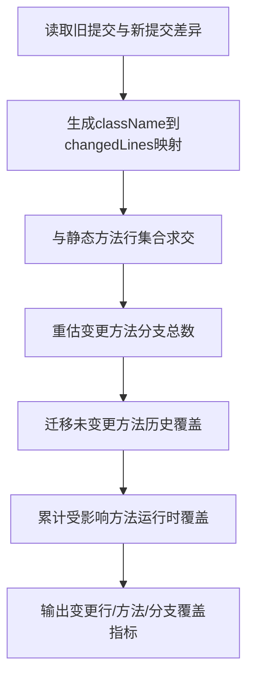

# P2-02 Git 提交差异驱动的覆盖率关联评估方法

- 状态：DRAFT
- 优先级：P2
- 风险：低
- 主要近似来源：通用架构（主）+ 行业常规（次）

## 1) 专利名称

一种 Git 提交差异驱动的覆盖率关联评估方法。

## 2) 背景技术

- 全量覆盖率只能反映系统整体质量，无法回答"本次提交改动是否被覆盖"。
- 简单把 Git diff 与类覆盖结果做关联，往往只能定位到类级，难以精确到受影响方法和受影响行。
- 对分支覆盖而言，若直接沿用全量分母，会放大未变更分支噪声，导致变更覆盖评估失真。

## 3) 现有缺陷

- 差异结果与覆盖率明细分离，缺少方法级变更裁剪机制。
- 分支覆盖缺少针对变更范围的有效分母估算。
- 历史覆盖结果在提交变化场景下缺少细粒度迁移规则。

## 4) 技术方案

- 获取旧提交与新提交之间的 `className -> changedLines` 差异映射。
- 用差异行集合裁剪静态方法行集合，仅保留受影响方法和受影响行。
- 根据变更命中的分支行占比，重估方法的有效分支总数。
- 对未命中变更行的方法迁移历史覆盖结果，对命中方法重新累计运行时覆盖数据。
- 输出类级、方法级以及变更范围的行/方法/分支覆盖指标。

### 变量及字段说明

- `baseRepoCommitId` 表示基线仓库提交标识；`repoCommitId` 表示目标仓库提交标识；`className` 表示类全名；`changedLines` 表示该类在两次提交之间的变更行号集合。
- `methodLineNumberMap` 表示"方法 -> 静态行号集合"的映射；`branchLineNumberSet` 表示方法内分支所在行号集合；`totalBranchCount` 表示方法全量分支数；`totalLineNumbers` 表示方法全量行号集合；`filteredLines` 表示变更行与方法静态行求交后的有效变更行集合。
- `coveredLineNumbers` 表示已覆盖行号集合；`coveredBranchIds` 表示已覆盖分支标识集合；`coveredLines` 表示已覆盖行数；`coveredBranches` 表示已覆盖分支数；`snapshotIds` 表示参与本轮统计的快照标识序列。
- `incTotalLines`、`incCoveredLines`、`incTotalMethods`、`incCoveredMethods`、`incTotalBranches`、`incCoveredBranches` 分别表示增量行/方法/分支的总数与已覆盖数量；`diffMap` 表示提交差异映射结果；`methodReuseRatio` 表示方法级历史覆盖结果复用比例。

## 5) 本发明创造的优点、有益的技术效果

- 把覆盖率评估从"类是否覆盖"推进到"变更行、变更方法、变更分支是否覆盖"。
- 通过方法行集裁剪和分支分母重估，提升变更覆盖指标的真实性。
- 通过未变更方法的历史覆盖迁移，减少重复计算成本并保持结果连续性。

## 6) 权利要求草案

### 独立权利要求1（一句话）

一种覆盖率关联评估方法，其特征在于：获取 Git 提交差异映射后，将变更行集合与静态源码方法行集合进行交集裁剪，并基于裁剪结果计算变更范围覆盖指标，同时对未命中变更行的方法复用历史覆盖结果。

### 从属权利要求2-5

- 权利要求2：根据权利要求1所述的方法，其特征在于，所述差异映射至少包含类名和该类对应的变更行号集合。
- 权利要求3：根据权利要求1所述的方法，其特征在于，所述方法级裁剪以静态方法行号集合与变更行号集合的交集为准。
- 权利要求4：根据权利要求1所述的方法，其特征在于，方法分支总数依据变更命中的分支行数量占比进行重估。
- 权利要求5：根据权利要求1所述的方法，其特征在于，对未命中变更行的方法迁移历史覆盖结果，对命中方法重新累计运行时覆盖数据。

### 技术关键点和欲保护点

- 技术关键点：Git 差异映射、方法行集裁剪、分支分母重估、历史覆盖迁移、变更范围指标输出。
- 欲保护点：以"差异采集 -> 方法行集裁剪 -> 分支重估 -> 历史覆盖迁移 -> 运行时覆盖累计 -> 变更指标输出"的处理链保护增量覆盖评估核心机制。

## 7) 发明内容

本方案由以下五个部件组成，各部件顺序衔接，共同完成从 Git 提交差异到变更覆盖指标输出的评估链路。

### 部件一：差异采集部件

**职责**：解析 `baseRepoCommitId` 与 `repoCommitId` 之间的源码变化，生成 `className -> changedLines` 差异映射。

具体而言，该部件读取两个提交之间的 Java 文件变更，把文件级 diff 转换为类级行号集合，并区分新增、修改和删除三类情况。数据上，例如该部件可输出 `com.demo.order.OrderService -> [42,43,47]`，表示后续评估只需围绕这 3 个变更行展开，而不是把整个 `OrderService` 全部纳入增量范围。

### 部件二：静态裁剪部件

**职责**：把差异映射与静态源码中的类、方法、分支元信息求交，确定真正受影响的方法、受影响行和有效分支分母。

具体而言，该部件读取 `methodLineNumberMap`、`branchLineNumberSet` 和 `totalBranchCount`，对每个方法计算 `filteredLines = totalLineNumbers ∩ changedLines`。若交集为空，则该方法不进入本次变更范围；若交集非空，则以 `filteredLines` 作为本次有效变更行集合。数据上，例如某方法静态行集合为 `[40,41,42,43,44]`，类级 `changedLines=[42,43,47]`，则交集得到 `[42,43]`；若该方法 `branchLineNumberSet=[42,60]`、`totalBranchCount=4`，且本次只命中分支行 `42`，则本次有效分支总数可重估为 `2`，而不是直接沿用全量 `4`。

### 部件三：历史迁移部件

**职责**：对未命中变更行的方法复用历史覆盖结果，避免无关方法被错误清零。

具体而言，该部件逐方法判断其静态行集合是否与 `changedLines` 相交。若不相交，则直接迁移历史 `coveredLineNumbers`、`coveredBranchIds`、`coveredLines`、`coveredBranches` 等覆盖事实；若相交，则取消直接继承，转由后续运行时累计重新计算。数据上，例如某类共有 `3` 个方法，仅 `1` 个方法与变更行相交，则其余 `2` 个方法可直接继承，方法级迁移比例为 `2/3`。

### 部件四：运行时累计部件

**职责**：对命中变更的方法累计本轮 Trace 覆盖事实，得到真实的运行时变更覆盖结果。

具体而言，该部件以 `snapshotIds` 为输入范围，只读取目标版本下有效快照对应的 Trace 数据，并把运行时执行行与静态 `totalLineNumbers` 再次求交，只统计静态已知行；分支覆盖则按 `coveredBranchIds` 去重累计。数据上，若当前版本 `v2.3.7` 下筛得 `3` 个有效快照，`snapshotIds=[snap_20260320_101500,snap_20260320_103000,snap_20260320_110000]`，且其中前 `2` 个快照已被历史报告处理，则本次只需新增处理最后 `1` 个快照对应的覆盖事实。

### 部件五：指标汇总部件

**职责**：统一汇总变更范围和整体范围的覆盖统计，输出类级、方法级和报告级指标。

具体而言，该部件至少输出 `incTotalLines`、`incCoveredLines`、`incTotalMethods`、`incCoveredMethods`、`incTotalBranches`、`incCoveredBranches` 等字段，并同步给出整体 `totalLines/coveredLines` 等摘要。数据上，例如某类最终得到 `incTotalLines=3`、`incCoveredLines=2`，则变更行覆盖率为 `66.67%`；若 `incTotalMethods=2`、`incCoveredMethods=1`，则变更方法覆盖率为 `50%`，这类指标直接回答"本次改动是否被覆盖"。

## 8) 具体实施例

### 实施例：订单服务提交变更的覆盖率关联评估

某次覆盖率关联评估请求的输入数据如下：

| 项目 | 数值 |
|---|---|
| 当前提交 | `commitB` |
| 基线提交 | `commitA` |
| 变更类 | `com.demo.order.OrderService` |
| 类级变更行 | `[42,43,47]` |
| 方法 `createOrder` 静态行集合 | `[40,41,42,43,44]` |
| 方法 `createOrder` 分支行集合 | `[42,60]` |
| 方法 `createOrder` 全量分支数 | `4` |
| 本轮有效快照 | `3` 个 |
| 本轮快照序列 | `[snap_20260320_101500,snap_20260320_103000,snap_20260320_110000]` |
| 历史已处理快照 | 前 `2` 个 |

按各部件执行后的处理过程如下：

1. **差异采集部件**读取 `commitA -> commitB` 的 Git diff，生成 `diffMap`，其中 `OrderService -> [42,43,47]`。
2. **静态裁剪部件**把 `createOrder` 的静态行集合 `[40,41,42,43,44]` 与变更行集合 `[42,43,47]` 求交，得到 `filteredLines=[42,43]`，由此确定该方法本轮只围绕 `2` 个变更行评估；同时依据 `branchLineNumberSet=[42,60]` 和 `totalBranchCount=4`，把本次有效分支总数重估为 `2`。
3. **历史迁移部件**继续检查同类其他方法，若 `cancelOrder`、`listOrders` 与变更行无交集，则直接迁移历史覆盖数据，方法级迁移比例为 `2/3`。
4. **运行时累计部件**对最后 `1` 个新增快照对应的 Trace 进行累计，发现本轮实际命中的变更行只有 `[42]`，并累计到 `coveredLineNumbers`；若本轮只命中其中 `1` 个有效分支，则 `coveredBranches=1`。
5. **指标汇总部件**据此输出如下结果：

| 方法 | 变更行集合 | 覆盖行集合 | 有效分支总数 | 已覆盖分支数 | 结论 |
|---|---|---|---:|---:|---|
| `createOrder` | `[42,43]` | `[42]` | 2 | 1 | 需要继续补测 |
| `cancelOrder` | `[]` | 历史迁移 | 0 | 0 | 直接复用 |
| `listOrders` | `[]` | 历史迁移 | 0 | 0 | 直接复用 |

最终报告摘要示例如下：

```json
{
  "incTotalLines": 2,
  "incCoveredLines": 1,
  "incTotalMethods": 1,
  "incCoveredMethods": 1,
  "incTotalBranches": 2,
  "incCoveredBranches": 1,
  "methodReuseRatio": "2/3"
}
```

本实施例中，系统先把 Git diff 收敛为类级行号集合，再把变更范围进一步裁剪到具体方法和具体行，未命中变更的方法直接继承历史覆盖事实，仅对真正受影响的方法做运行时累计，因此输出结果可以准确回答"哪些变更行已覆盖、哪些变更分支未覆盖、哪些方法无需重算"。

### 效果图

图2：Git 提交差异驱动的覆盖率评估效果示意

```
┌─────────────────────────────────────────────────────────────────────────────────────┐
│  变更覆盖率评估报告                                     commitA → commitB          │
├─────────────────────────────────────────────────────────────────────────────────────┤
│                                                                                     │
│  提交差异概览                                                                       │
│  ─────────────────────────────────────────────────────────────────────────────      │
│  变更类: com.demo.order.OrderService        变更行: [42, 43, 47]                    │
│                                                                                     │
│  ┌─ 变更范围覆盖指标 ─────────────────────────────────────────────────────────┐    │
│  │                                                                            │    │
│  │  ┌─────────────────┐  ┌─────────────────┐  ┌─────────────────┐            │    │
│  │  │    变更行       │  │   变更方法      │  │   变更分支      │            │    │
│  │  │  ────────────   │  │  ────────────   │  │  ────────────   │            │    │
│  │  │  总数:    2     │  │  总数:    1     │  │  总数:    2     │            │    │
│  │  │  已覆盖:  1     │  │  已覆盖:  1     │  │  已覆盖:  1     │            │    │
│  │  │  覆盖率: 50% ⚠  │  │  覆盖率: 100%   │  │  覆盖率: 50% ⚠  │            │    │
│  │  └─────────────────┘  └─────────────────┘  └─────────────────┘            │    │
│  └────────────────────────────────────────────────────────────────────────────┘    │
│                                                                                     │
│  ┌─ 方法级评估明细 ───────────────────────────────────────────────────────────┐    │
│  │                                                                            │    │
│  │  方法                    │ 变更行 │ 覆盖行 │ 有效分支 │ 已覆盖分支 │ 结论   │    │
│  ├──────────────────────────┼────────┼────────┼──────────┼────────────┼────────┤    │
│  │  createOrder             │ [42,43]│  [42]  │    2     │     1      │ ⚠ 需补测│    │
│  │  cancelOrder             │   []   │ 历史迁移│    0     │     0      │ ✓ 直接复用│   │
│  │  listOrders              │   []   │ 历史迁移│    0     │     0      │ ✓ 直接复用│   │
│  │                                                                            │    │
│  └────────────────────────────────────────────────────────────────────────────┘    │
│                                                                                     │
│  历史覆盖迁移统计                                                                   │
│  ─────────────────────────────────────────────────────────────────────────────      │
│  方法级复用比例: 2/3 (66.7%)        受影响方法: 1 个        需要补测: 1 个           │
│                                                                                     │
│  建议: 变更行覆盖率 50%，建议补充以下测试用例:                                       │
│        - OrderService#createOrder 行 43 未覆盖                                      │
│        - 分支行 60 未覆盖                                                           │
│                                                                                     │
└─────────────────────────────────────────────────────────────────────────────────────┘
```

## 9) 附图

以下附图为白色背景线条图（黑色线条）的流程示意，用于清晰表达本方案结果与处理路径。

图1：Git 差异驱动覆盖评估流程图（Mermaid）



## 10) 待补事项

### 必须补充

- 补充 1 组真实增量评估样本，记录 `changedLines`、`incTotalLines`、`incCoveredLines`；
- 补充 1 组历史覆盖迁移样本，记录方法级迁移比例。

### 可后补充

- 可补充不同提交规模下的增量计算收益数据；
- 可补充变更分支覆盖率与发布质量门禁之间的阈值样本。
