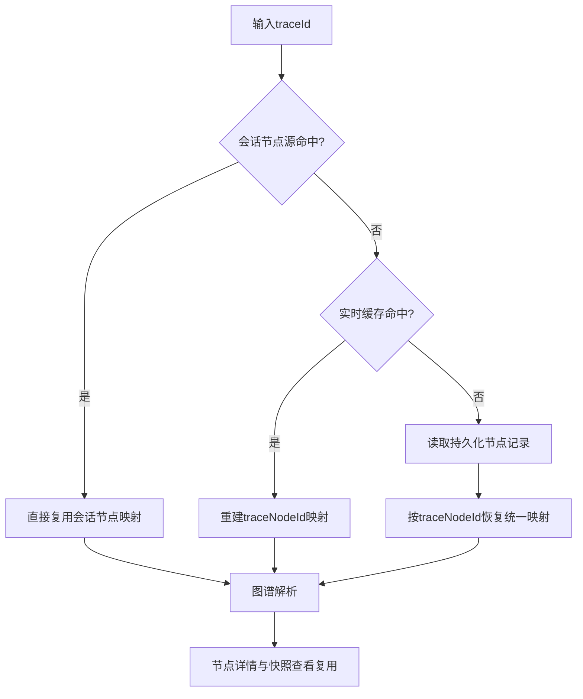

# P2-03 基于会话态节点源与持久化节点源协同复用的 Trace 回溯方法

- 状态：DRAFT
- 优先级：P2
- 风险：中
- 主要近似来源：通用架构（主）+ 行业常规（次）

## 1) 专利名称

一种基于会话态节点源与持久化节点源协同复用的 Trace 回溯方法。

## 2) 背景技术

- 在线监控查看 Trace 图谱和节点详情时，用户更关注低延迟回放，但单一节点来源容易出现未命中或节点不完整的问题。
- 图谱页面和节点详情页面若各自重新查询 Trace 节点，会产生重复 I/O 和重复解析开销。
- 运行时节点通常使用 `traceNodeId` 组织，而持久化节点通常使用复合主键，若缺少统一键模型，实时数据与持久化数据难以复用。

## 3) 现有缺陷

- 会话、实时缓存和持久化节点源之间缺少统一回溯顺序。
- 图谱和详情未共享同一份节点映射，重复构建成本高。
- 运行时键与持久化键转换缺少统一规则，导致回放链路割裂。

## 4) 技术方案

- 优先复用会话中的 Trace 节点源，降低页面回放延迟。
- 当会话未命中时，读取实时节点缓存；在需要持久化追溯时，再从持久化节点源重建映射。
- 统一以 `traceNodeId` 作为运行时映射键，以 `traceId_traceNodeId` 作为持久化主键。
- 将同一份节点映射同时复用于图谱解析、节点详情和快照查看场景。
- 对未命中场景输出统一异常提示。

### 变量及字段说明

- `traceId` 表示 Trace 标识；`traceNodeId` 表示 Trace 内单个节点标识；`traceId_traceNodeId` 表示“Trace 标识 + 节点标识”组成的持久化主键。
- `model-` 表示会话缓存键前缀；`trace:nodes:{traceId}` 表示按 Trace 标识聚合的实时节点缓存键。
- `Map<traceNodeId, TraceNode>` 表示“节点标识 -> Trace 节点对象”的统一运行时映射结构；`nodeMap.size` 表示该映射中的节点数量；`key` 表示映射中的单个运行时键值。

## 5) 本发明创造的优点、有益的技术效果

- 在保证可追溯性的同时缩短图谱与详情查看的响应路径。
- 减少图谱和详情页面的重复查询与重复解析。
- 打通会话态节点源与持久化节点源之间的键模型，提升回放稳定性。

## 6) 权利要求草案

### 独立权利要求1（一句话）

一种 Trace 回溯方法，其特征在于：按照会话态节点源、实时节点缓存和持久化节点源的优先顺序获取 Trace 节点集合，并将节点统一重建为以 `traceNodeId` 为键的映射结构，供图谱解析和节点详情复用。

### 从属权利要求2-5

- 权利要求2：根据权利要求1所述的方法，其特征在于，会话缓存键采用 `model-` 前缀与 `traceId` 组合形成。
- 权利要求3：根据权利要求1所述的方法，其特征在于，实时节点缓存以 `trace:nodes:{traceId}` 形式保存节点集合。
- 权利要求4：根据权利要求1所述的方法，其特征在于，持久化节点主键采用 `traceId_traceNodeId` 组合形式。
- 权利要求5：根据权利要求1所述的方法，其特征在于，同一份节点映射同时供图谱页面和节点详情页面复用。

### 技术关键点和欲保护点

- 技术关键点：多节点源优先级、统一键模型、节点映射重建、图谱与详情复用。
- 欲保护点：以“会话优先 -> 实时缓存补位 -> 持久化重建 -> 统一节点映射 -> 图谱与详情复用”的处理链保护 Trace 回溯核心机制。

## 7) 发明内容

本方案由以下五个部件组成，各部件顺序衔接，共同完成不同节点源之间的 Trace 回放与页面复用。

### 部件一：会话读取部件

**职责**：优先读取当前会话中的 Trace 节点源，为图谱和详情回放提供最低时延入口。

具体而言，该部件按 `model-` + `traceId` 规则定位会话态节点源，若命中则直接复用已有节点集合，不再进入更重的缓存或持久化查询路径。数据上，例如 `traceId=T20260325_001` 时，会话键为 `model-T20260325_001`，若命中则可立即取得整条 Trace 的节点映射。

### 部件二：实时缓存部件

**职责**：在会话未命中时读取以 `traceId` 聚合的实时节点集合，作为第二优先级回放来源。

具体而言，该部件读取 `trace:nodes:{traceId}` 对应的节点集合，把最近上报且仍在缓存期内的 Trace 节点统一取回。数据上，例如 `trace:nodes:T20260325_001` 可直接返回 `nodeMap.size=47` 的节点集合，此时图谱和详情页面无需分别重复读取这 `47` 个节点。

### 部件三：持久化回溯部件

**职责**：在会话和实时缓存均不可用，或需要历史追溯时，从持久化节点源恢复完整节点集合。

具体而言，该部件按 `traceId_traceNodeId` 形式查询持久化节点记录，再把查询结果恢复为运行时可直接使用的 Trace 节点集合。数据上，例如持久化主键 `T20260325_009_1.remote` 在恢复后会对应运行时节点 `traceNodeId=1.remote`，从而保证历史 Trace 与实时 Trace 使用同一页面逻辑。

### 部件四：键统一部件

**职责**：把不同来源节点统一转换为 `Map<traceNodeId, TraceNode>` 结构，消除载体差异。

具体而言，该部件不论节点来源于会话、实时缓存还是持久化存储，最终都以 `traceNodeId` 作为运行时映射键，形成可复用的统一节点映射。数据上，例如持久化主键 `T20260325_009_1.remote` 在重建后映射为 `key=1.remote`，图谱解析和详情查询都只围绕该统一键工作。

### 部件五：结果分发部件

**职责**：把统一节点映射同时分发给图谱解析、节点详情和快照查看场景，避免重复构图准备。

具体而言，该部件使图谱页面先基于统一映射构建节点和边，详情页面再按 `traceNodeId` 直接从同一映射中取值，无需再次查库或反序列化。数据上，例如一次请求中图谱需要解析 `47` 个节点，而详情页只查看其中 `traceNodeId=12` 的单个节点时，详情页不再重复读取整条 Trace。

## 8) 具体实施例

### 实施例：会话未命中、实时缓存命中的 Trace 回放

某次 Trace 回放请求的输入数据如下：

| 项目 | 数值 |
|---|---|
| `traceId` | `T20260325_001` |
| 会话键 | `model-T20260325_001` |
| 实时缓存键 | `trace:nodes:T20260325_001` |
| 实时节点数 | `47` |
| 目标详情节点 | `traceNodeId=12` |

按各部件执行后的处理过程如下：

1. **会话读取部件**先检查 `model-T20260325_001`，发现未命中，因此转入下一来源。
2. **实时缓存部件**读取 `trace:nodes:T20260325_001`，一次性取回 `47` 个实时节点，作为本轮回放的数据源。
3. **持久化回溯部件**在本例中不触发，因为实时缓存已经满足回放条件；若实时缓存也未命中，则才会按 `traceId_traceNodeId` 前缀查询持久化记录。
4. **键统一部件**把这 `47` 个节点统一转换为 `Map<traceNodeId, TraceNode>`，例如把详情页目标节点固定为 `key=12`。
5. **结果分发部件**先将该映射交给图谱解析生成节点和边，再让详情页直接复用同一映射读取 `traceNodeId=12` 的节点详情。

输出结果示例如下：

| 来源 | 命中情况 | 节点数 | 后续用途 |
|---|---|---:|---|
| 会话 | 未命中 | 0 | 进入下一层 |
| 实时缓存 | 命中 | 47 | 图谱与详情共享 |
| 持久化 | 未触发 | 0 | 保留为兜底路径 |

本实施例中，系统先尝试低时延会话源，再复用实时缓存中的 `47` 个节点，并把这批节点统一重建为按 `traceNodeId` 索引的运行时映射。这样图谱和详情共享同一份节点数据，既减少了重复读取和重复解析，也保证了两个页面的回放口径一致。

### 效果图

图2：Trace 回溯与页面复用效果示意

```
┌─────────────────────────────────────────────────────────────────────────────────────┐
│  调用链回放                                     TraceID: T20260325_001              │
├─────────────────────────────────────────────────────────────────────────────────────┤
│                                                                                     │
│  ┌─ 节点源命中状态 ───────────────────────────────────────────────────────────┐    │
│  │                                                                            │    │
│  │  会话节点源        实时缓存          持久化存储                              │    │
│  │  ┌─────────┐      ┌─────────┐        ┌─────────┐                           │    │
│  │  │ 未命中  │  →   │  命中 ✓ │   →    │ 未触发  │                           │    │
│  │  │  0 节点 │      │ 47 节点 │        │  0 节点 │                           │    │
│  │  └─────────┘      └─────────┘        └─────────┘                           │    │
│  │                                                                            │    │
│  │  回溯路径: 会话 → 实时缓存(命中) → 复用节点映射                              │    │
│  │  节点映射大小: 47 个节点                                                    │    │
│  └────────────────────────────────────────────────────────────────────────────┘    │
│                                                                                     │
│  ┌─ 调用链图谱视图 ───────────────────────┐  ┌─ 节点详情视图 ─────────────────┐    │
│  │                                        │  │                                │    │
│  │    ┌─────┐     ┌─────┐                │  │  节点ID: 12                    │    │
│  │    │  1  │ ──→ │  5  │                │  │  类型: SQL                      │    │
│  │    └──┬──┘     └──┬──┘                │  │  ─────────────────────────     │    │
│  │       │           │                    │  │  SQL内容:                      │    │
│  │       ▼           ▼                    │  │  SELECT * FROM order_info      │    │
│  │    ┌─────┐     ┌─────┐                │  │  WHERE id = ?                  │    │
│  │    │  8  │     │ 12  │ ← 当前选中      │  │                                │    │
│  │    └──┬──┘     └─────┘                │  │  执行时间: 23ms                 │    │
│  │       │                                │  │  影响行数: 1                    │    │
│  │       ▼                                │  │                                │    │
│  │    ┌─────┐                            │  │  [查看完整SQL] [关联快照]       │    │
│  │    │ 15  │                            │  │                                │    │
│  │    └─────┘                            │  └────────────────────────────────┘    │
│  │                                        │                                        │
│  │  (共享同一份节点映射，无需重复查询)      │  (直接从映射中读取 traceNodeId=12)   │    │
│  └────────────────────────────────────────┘                                        │
│                                                                                     │
└─────────────────────────────────────────────────────────────────────────────────────┘
```

## 9) 附图

以下附图为白色背景线条图（黑色线条）的流程示意，用于清晰表达本方案结果与处理路径。

图1：Trace 节点协同回溯与复用流程图（Mermaid）



## 10) 待补事项

### 必须补充

- 补充 1 组实时缓存命中样本，记录节点数与页面复用次数；
- 补充 1 组持久化回溯样本，记录持久化主键到运行时键的恢复结果。

### 可后补充

- 可补充三类节点源的命中率分布；
- 可补充图谱与详情复用前后的查询次数对比。
