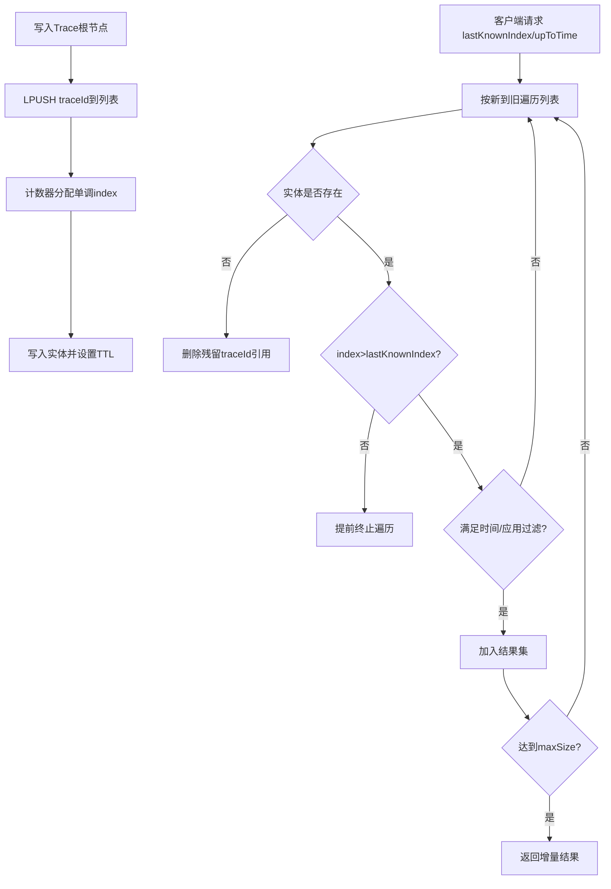

# P3-01 面向实时观测的 Trace 缓存窗口化增量拉取方法

- 状态：READY
- 优先级：P3
- 风险：低
- 分级：A（核心算法型）
- 独立性说明：不复用既有 P1/P2 主题，核心问题为“高频拉取下的窗口化增量返回与过期自清理”。

## 1) 专利名称

一种面向实时观测的 Trace 缓存窗口化增量拉取方法。

## 2) 背景技术

- 实时链路观测页面通常采用轮询拉取，若每次全量返回会导致网络与序列化开销激增。
- 缓存中条目存在 TTL 失效，若索引结构与实体存储分离，容易出现“列表可见但实体已过期”的空洞数据。
- 现有方案常见问题是增量边界不稳定，前端重复接收历史项或遗漏窗口内新项。

## 3) 现有缺陷

- 缺乏单调索引驱动的增量边界判定机制。
- 缺乏“过期探测 + 结构自清理”一体化处理。
- 在多应用筛选场景下难以同时保证实时性与结果上限控制。

## 4) 技术方案

- 维护“列表索引 + 实体索引 + 单调计数器”三元缓存结构。
- 写入时采用左压入队列并分配单调递增索引，形成天然时间序。
- 拉取时以 `lastKnownIndex` 作为边界，只返回索引更大的新条目。
- 拉取过程中探测到实体过期则同步清理队列残留引用。
- 提供时间窗口拉取模式，按 `upToTime` 截断并支持应用维度过滤。
- 使用 `maxSize` 限流保证单次响应可控。

### 变量及字段说明

- `lastKnownIndex` 表示客户端已知的最新索引边界；`upToTime` 表示向前回看的时间窗口长度；`maxSize` 表示单次返回结果上限。
- `A` 表示应用过滤集合；`Q` 表示按“新到旧”排列的缓存序列；`M` 表示以 `traceId` 为键的实体映射；`R` 表示本轮增量结果集；`threshold` 表示由当前时间减去 `upToTime` 得到的窗口阈值。
- `traceId` 表示链路标识；`item.index` 表示条目的单调索引；`item.cacheTime` 表示条目写入缓存的时间；`item.appId` 表示条目所属应用标识；`size(R)` 表示当前结果集大小。
- `items` 表示响应中的增量条目数组；`cleanup` 表示本轮顺带清理掉的过期条目标识集合；`stoppedBy` 表示本轮停止遍历的原因，例如命中 `maxSize` 或增量边界。

### 4.1 算法问题定义

- 输入：`lastKnownIndex`、`upToTime`、`maxSize`、应用过滤集合 `A`、缓存序列 `Q`（新到旧）、实体映射 `M`。
- 输出：增量结果集 `R`，满足 `|R|<=maxSize` 且每个元素满足时间窗口与应用过滤约束。
- 目标：在保证一致性（不重复、不漏增量）的前提下最小化扫描长度与返回体积。

### 4.2 核心算法（窗口化增量拉取）

```text
Algorithm WindowIncrementalPull(lastKnownIndex, upToTime, maxSize, A, Q, M):
  R <- []
  threshold <- now - upToTime
  for traceId in Q (from head to tail):
    item <- M.get(traceId)
    if item == null:
      Q.remove(traceId)               // 过期自修复
      continue
    if item.index <= lastKnownIndex:
      break                           // 增量边界提前终止
    if item.cacheTime <= threshold:
      break                           // 时间窗口剪枝
    if A is null or item.appId in A:
      R.add(item)
    if size(R) >= maxSize:
      break                           // 限流
  return R
```

### 4.3 复杂度与正确性要点

- 时间复杂度：`O(k)`，`k` 为本次实际扫描条目数（通常远小于全量）。
- 空间复杂度：`O(maxSize)`。
- 正确性要点：
  - 单调索引保证“边界停止”后无漏项；
  - 过期自修复保证队列与实体一致性；
  - 窗口剪枝与限流保证请求时延上界。

### 4.4 量化指标建议（READY可采集）

- 增量命中率：`新增返回条目 / 扫描条目`。
- 窗口剪枝率：`被时间窗口提前截断的扫描节省比例`。
- 过期修复率：`修复残留ID数 / 扫描条目`。
- 传输降幅：与全量拉取相比的返回字节下降比例。

## 5) 本发明创造的优点、有益的技术效果

- 在高频轮询场景下显著减少重复传输与反序列化成本。
- 消除“队列残留 ID 与实体失效”导致的数据不一致。
- 将实时增量、按时间回看、按应用筛选统一到一个缓存访问模型。

## 6) 权利要求草案

### 独立权利要求1（一句话）

一种 Trace 缓存增量拉取方法，其特征在于：基于列表、实体与单调计数器构成三元缓存结构，在拉取阶段按已知索引边界返回增量条目并对过期实体执行队列引用清理，输出受时间窗口和应用过滤约束的结果集。

### 从属权利要求2-5

- 权利要求2：根据权利要求1所述方法，其特征在于，写入阶段采用左压入策略并通过原子计数器为条目分配单调索引。
- 权利要求3：根据权利要求1所述方法，其特征在于，当拉取发现实体键不存在时，立即删除队列中的对应标识以修复索引结构。
- 权利要求4：根据权利要求1所述方法，其特征在于，增量拉取在命中索引小于或等于已知边界时提前终止遍历。
- 权利要求5：根据权利要求1所述方法，其特征在于，方法支持以时间窗口和应用标识列表作为联合筛选条件。

### 技术关键点和欲保护点

- 技术关键点：单调索引边界、TTL 过期探测、队列残留自清理、窗口化增量截断。
- 欲保护点：将“边界判定 -> 条目筛选 -> 过期修复 -> 结果限流”固化为统一处理链。

## 7) 发明内容

本方案由以下五个部件组成，各部件顺序衔接，共同完成 Trace 缓存的窗口化增量拉取。

### 部件一：写入编排部件

**职责**：接收根节点链路条目并写入“三元缓存结构”，为后续增量拉取建立稳定时间序。

具体而言，该部件将 `traceId` 左压入列表，同时为每个实体分配单调递增 `index` 并写入实体缓存。数据上，例如最新写入条目可依次形成 `t101` 到 `t105` 的索引映射 `101~105`。

### 部件二：增量边界部件

**职责**：根据客户端上报的 `lastKnownIndex` 确定本轮新增数据边界。

具体而言，该部件从新到旧遍历列表，一旦遇到 `item.index <= lastKnownIndex` 就立即停止扫描，确保不重复返回历史项。数据上，例如 `lastKnownIndex=102` 时，`index=105/104/103` 仍属于候选新增项，而 `index=102` 及之前的条目直接被边界截断。

### 部件三：过期修复部件

**职责**：在扫描过程中识别实体已过期但列表残留的条目，并同步修复索引结构。

具体而言，该部件当发现 `M.get(traceId)==null` 时，立即删除列表中的对应 `traceId`，避免后续请求重复扫描失效条目。数据上，例如 `t104` 已过期但仍残留在列表中时，该部件会在当前请求中直接将其清理掉。

### 部件四：窗口过滤部件

**职责**：对候选增量项施加时间窗口和应用维度过滤，只保留用户真正需要的新数据。

具体而言，该部件根据 `upToTime` 计算窗口阈值，并结合应用集合 `A` 判断当前条目是否应进入结果集。数据上，例如 `upToTime=300s、A={app-order}` 时，只有最近 `300` 秒内且 `appId=app-order` 的条目会被纳入返回结果。

### 部件五：限流输出部件

**职责**：在达到 `maxSize` 时停止收集并输出结果，控制单次响应体积和时延。

具体而言，该部件在结果集达到阈值后立即返回 `items`、`cleanup` 和 `stoppedBy` 等字段。数据上，例如 `maxSize=2` 时，本轮最多只返回 `2` 条新增链路项，即使列表中还有更多候选条目也不继续扩展。

## 8) 具体实施例

### 实施例：最近 5 分钟窗口下的增量拉取

某次前端轮询请求的输入数据如下：

| 项目 | 数值 |
|---|---|
| 缓存队列（新到旧） | `[t105, t104, t103, t102, t101]` |
| 索引映射 | `t105->105, t104->104, t103->103, t102->102, t101->101` |
| `lastKnownIndex` | `102` |
| `maxSize` | `2` |
| `upToTime` | `300s` |
| 应用过滤集合 | `{app-order}` |
| 运行状态 | `t104` 实体已过期；`t105`、`t103` 属于 `app-order` |

按各部件执行后的处理过程如下：

1. **写入编排部件**已预先把 `t101~t105` 写入三元缓存结构，并分配单调索引。
2. **增量边界部件**从列表头部开始扫描，发现 `t105.index=105 > 102`，继续处理；后续只要遇到 `index<=102` 就会立即停止。
3. **过期修复部件**扫描到 `t104` 时发现实体不存在，因此直接删除列表中的 `t104` 残留引用。
4. **窗口过滤部件**对 `t105` 和 `t103` 继续判断，确认它们都位于最近 `300` 秒窗口内，且 `appId=app-order`，因此加入结果集。
5. **限流输出部件**在结果集达到 `maxSize=2` 时停止遍历，输出如下结果：

```json
{
  "items": [
    {"traceId": "t105", "index": 105, "appId": "app-order"},
    {"traceId": "t103", "index": 103, "appId": "app-order"}
  ],
  "cleanup": ["t104"],
  "stoppedBy": "maxSize"
}
```

本实施例中，系统只返回边界之后的增量项，不会重复返回 `t102` 和 `t101`；同时在本轮读取中顺手修复了 `t104` 的过期残留，并把返回结果限制在 `2` 条以内，从而兼顾一致性、实时性和响应体积控制。

### 效果图

图2：Trace 缓存窗口化增量拉取效果示意

```
┌─────────────────────────────────────────────────────────────────────────────────────┐
│  实时链路观测                                           项目: P001                  │
├─────────────────────────────────────────────────────────────────────────────────────┤
│                                                                                     │
│  轮询参数配置                                                                       │
│  ─────────────────────────────────────────────────────────────────────────────      │
│  lastKnownIndex: 102       upToTime: 300s          maxSize: 2                       │
│  应用过滤: {app-order}                                                              │
│                                                                                     │
│  ┌─ 缓存队列状态 (新到旧) ─────────────────────────────────────────────────────┐    │
│  │                                                                            │    │
│  │  索引:  105    104    103    102    101                                    │    │
│  │         ┌──┐   ┌──┐   ┌──┐   ┌──┐   ┌──┐                                  │    │
│  │         │t105│  │t104│  │t103│  │t102│  │t101│                              │    │
│  │         └──┘   └──┘   └──┘   └──┘   └──┘                                  │    │
│  │           │      │      │      │      │                                    │    │
│  │           ▼      ▼      ▼      ▼      ▼                                    │    │
│  │         命中   过期✗   命中   边界   旧数据                                  │    │
│  │         ✓      清理    ✓     截止   不处理                                  │    │
│  │                                                                            │    │
│  └────────────────────────────────────────────────────────────────────────────┘    │
│                                                                                     │
│  ┌─ 增量拉取结果 ─────────────────────────────────────────────────────────────┐    │
│  │                                                                            │    │
│  │  返回条目: 2 (达到 maxSize 限制)                                            │    │
│  │  清理条目: 1 (t104 过期残留已清理)                                          │    │
│  │  停止原因: maxSize                                                          │    │
│  │                                                                            │    │
│  │  ┌─────────────────────────────────────────────────────────────────────┐  │    │
│  │  │ traceId: t105  │ index: 105 │ appId: app-order │ 时间: 10:45:32    │  │    │
│  │  └─────────────────────────────────────────────────────────────────────┘  │    │
│  │  ┌─────────────────────────────────────────────────────────────────────┐  │    │
│  │  │ traceId: t103  │ index: 103 │ appId: app-order │ 时间: 10:44:18    │  │    │
│  │  └─────────────────────────────────────────────────────────────────────┘  │    │
│  │                                                                            │    │
│  └────────────────────────────────────────────────────────────────────────────┘    │
│                                                                                     │
│  性能指标: 扫描条目 3 | 增量命中 2 | 过期修复 1 | 传输降幅 60%                        │
│                                                                                     │
└─────────────────────────────────────────────────────────────────────────────────────┘
```

## 9) 附图

图1：Trace 缓存窗口化增量拉取流程图（Mermaid）



## 10) 证据锚点（READY）

- `oAT-service/oAT-service-web/src/main/java/com/oAT/web/service/TraceNodeCache.java` `put(...)` 行 27-47。
- `oAT-service/oAT-service-web/src/main/java/com/oAT/web/service/TraceNodeCache.java` `add(...)` 行 59-78。
- `oAT-service/oAT-service-web/src/main/java/com/oAT/web/service/TraceNodeCache.java` `getRange(...)` 行 85-113。
- `oAT-service/oAT-service-web/src/main/java/com/oAT/web/service/TraceNodeCache.java` `getRangeByTime(...)` 行 155-182。
- `oAT-service/oAT-service-web/src/main/java/com/oAT/web/service/impl/ClientSessionServiceImpl.java`（实时观测调用场景证据）。
