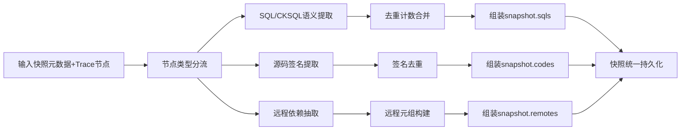

# P3-02 面向系统快照的多模态语义压缩构建方法

- 状态：READY
- 优先级：P3
- 风险：中
- 分级：A（核心算法型）
- 独立性说明：不复用既有 P1/P2 主体，核心问题为“Trace 原始节点向快照可检索语义对象的压缩构建”。

## 1) 专利名称

一种面向系统快照的多模态语义压缩构建方法。

## 2) 背景技术

- 运行链路原始节点包含 SQL、源码调用、远程调用等异构信息，直接落库存储冗余高且难以检索。
- 现有快照系统常将多模态信息分散处理，无法形成统一语义模型，导致后续检索与评审链路长。
- 缺乏对 SQL 语义动作、源码签名、远程调用目标的协同抽取与去重策略。

## 3) 现有缺陷

- 异构节点缺乏统一语义压缩流程。
- SQL 统计、源码签名、远程调用描述常分离，难以形成快照级视图。
- 多库类型场景下难统一动作抽象口径。

## 4) 技术方案

- 对 Trace 节点进行类型分流：SQL、ClickHouse SQL、代码节点、远程调用节点。
- 对 SQL 节点执行语句级去重和执行次数累积，并抽取动作-表语义对。
- 对代码节点构建“类名 + 方法名”标准签名并去重，形成执行源码集合。
- 对远程调用节点抽取调用接口、目标地址与目标应用标识。
- 将上述语义对象压缩到快照字段 `sqls/codes/remotes`，并与快照元数据一次性持久化。

### 变量及字段说明

- `sqls`、`codes`、`remotes` 分别表示快照中的 SQL 语义集合、源码签名集合和远程依赖集合；`N` 表示输入的 Trace 节点集合；`S` 表示输出的快照语义三元组。
- `sqlMap` 表示以 SQL 文本为键的 SQL 语义映射；`codeSet` 表示去重后的源码签名集合；`remoteSet` 表示去重后的远程依赖集合；`k` 或 `key` 表示去重时使用的键值。
- `model-table` 表示“动作类型-目标表名”语义对；`count` 表示同一 SQL 的累计出现次数；`interface` 表示远程调用接口；`address` 表示远程调用地址；`appId` 表示目标应用标识；`remoteTuple` 表示远程依赖元组。
- `content` 表示 SQL 原文；`databaseType` 表示数据库类型；`actions` 表示 SQL 动作语义数组；`model` 表示动作类型；`table` 表示目标表名；`url` 表示远程调用地址；`invokerInterface` 表示远程调用接口全名。

### 4.1 算法问题定义

- 输入：Trace 节点集合 `N`，其中节点类型属于 `{SQL, CKSQL, CODE, DUBBO}`。
- 输出：快照语义三元组 `S = {sqls, codes, remotes}`。
- 目标函数：在语义完整约束下最小化冗余，`min |S|`，并保持跨场景复用一致性。

### 4.2 核心算法（多模态语义压缩）

```text
Algorithm BuildSnapshotSemantic(N):
  sqlMap <- {}          // key: sqlContent
  codeSet <- set()
  remoteSet <- set()

  for node in N:
    switch type(node):
      case SQL or CKSQL:
        k <- node.sql
        if k not in sqlMap:
          sqlMap[k] <- ParseSqlSemantic(node)
          sqlMap[k].count <- 1
        else:
          sqlMap[k].count++
      case CODE:
        codeSet.add(NormalizeClassMethod(node))
      case DUBBO:
        remoteSet.add(BuildRemoteTuple(node))

  return {values(sqlMap), values(codeSet), values(remoteSet)}
```

### 4.3 复杂度分析

- 时间复杂度：`O(n + p)`，`n` 为节点数，`p` 为 SQL 解析开销总和。
- 空间复杂度：`O(u_sql + u_code + u_remote)`，`u_*` 为去重后唯一元素数。
- 稳定性：以 SQL 文本、标准化方法签名、远程元组作为键，保证幂等聚合。

### 4.4 量化指标建议

- 压缩率：`1 - (|S| / |N|)`。
- SQL 去重率：`1 - (u_sql / raw_sql_count)`。
- 快照体积降幅：压缩前后字节对比。
- 语义复用率：可直接被检索/图展示复用的字段占比。

## 5) 本发明创造的优点、有益的技术效果

- 将高噪声 Trace 数据压缩为可检索、可展示、可统计的快照语义对象。
- 显著降低快照层后续搜索与分析的数据准备成本。
- 形成数据库、代码、远程依赖三类语义的统一口径，增强跨场景复用。

## 6) 权利要求草案

### 独立权利要求1（一句话）

一种系统快照语义构建方法，其特征在于：对 Trace 异构节点执行类型分流、语义抽取、去重计数与标准化映射，将 SQL 动作语义、源码签名语义和远程调用语义压缩写入快照对象并完成持久化。

### 从属权利要求2-5

- 权利要求2：根据权利要求1所述方法，其特征在于，SQL 节点采用语句内容键进行去重，并累积出现次数。
- 权利要求3：根据权利要求1所述方法，其特征在于，SQL 语义通过语法树访问器提取动作类型与目标表名。
- 权利要求4：根据权利要求1所述方法，其特征在于，代码节点转化为“类名+方法名”标准签名并进行去重收敛。
- 权利要求5：根据权利要求1所述方法，其特征在于，远程调用语义至少包括调用接口标识、目标地址和目标应用标识。

### 技术关键点和欲保护点

- 技术关键点：多模态分流、语义标准化、去重计数、统一持久化。
- 欲保护点：将“分流 -> 抽取 -> 去重 -> 压缩落库”定义为快照语义构建的主处理链。

## 7) 发明内容

本方案由以下五个部件组成，各部件顺序衔接，共同完成 Trace 原始节点向快照语义对象的压缩构建。

### 部件一：多模态分流部件

**职责**：按节点类型把 Trace 原始节点分发到不同语义处理通道。

具体而言，该部件识别 `SQL`、`CKSQL`、`CODE`、`DUBBO` 等节点类型，并将其分别送入 SQL、源码签名和远程依赖处理链。数据上，例如一个包含 `6` 个节点的 Trace 中，可以拆分为 `3` 个 SQL 节点、`2` 个代码节点和 `1` 个 Dubbo 节点。

### 部件二：SQL 语义提取部件

**职责**：对 SQL/CKSQL 节点执行语义抽取、动作归类和计数合并。

具体而言，该部件以 SQL 文本为 key 去重，借助 SQL 解析器抽取 `model-table` 语义，并统计同一 SQL 的出现次数。数据上，例如 `SELECT * FROM order_info WHERE id = ?` 若重复出现 `2` 次，则该部件只保留 `1` 条 SQL 语义对象，并把 `count=2`。

### 部件三：源码签名提取部件

**职责**：把代码节点标准化为“类名 + 方法名”签名，并对重复调用去重。

具体而言，该部件把 `com.demo.OrderService#createOrder` 之类的调用节点转换为稳定签名集合，避免同一方法在一次 Trace 中被重复存储。数据上，若 `com.demo.OrderService#createOrder` 出现 `2` 次，则最终 `codes` 中只保留 `1` 条标准化签名。

### 部件四：远程依赖抽取部件

**职责**：从远程调用节点中抽取接口、目标地址和目标应用标识，形成可复用的远程元组。

具体而言，该部件将 Dubbo 等远程调用统一映射为 `interface + address + appId` 结构。数据上，例如 `com.demo.user.UserFacade#getUser` 和 `dubbo://10.0.0.9:20880` 可被映射为 `remoteTuple={interface:UserFacade#getUser,address:10.0.0.9:20880,appId:user-service}`。

### 部件五：快照压缩持久化部件

**职责**：把 `sqls`、`codes`、`remotes` 三类语义对象与快照元数据一次性写入存储。

具体而言，该部件统一组装快照语义三元组并持久化，使检索、拓扑和评审场景都可直接复用压缩结果。数据上，例如原始 `6` 个节点最终可被压缩为 `4` 个语义对象，即 `2` 条 SQL、`1` 条代码签名和 `1` 条远程依赖。

## 8) 具体实施例

### 实施例：订单快照的多模态语义压缩

某次快照构建时接收到的 Trace 节点数据如下：

| 节点类型 | 内容 |
|---|---|
| SQL-1 | `SELECT * FROM order_info WHERE id = ?` |
| SQL-2 | `SELECT * FROM order_info WHERE id = ?` |
| SQL-3 | `UPDATE order_info SET status = ? WHERE id = ?` |
| CODE-1 | `com.demo.OrderService#createOrder` |
| CODE-2 | `com.demo.OrderService#createOrder` |
| DUBBO-1 | `com.demo.user.UserFacade#getUser`，`dubbo://10.0.0.9:20880` |

按各部件执行后的处理过程如下：

1. **多模态分流部件**把 `6` 个节点拆分为 `3` 个 SQL 节点、`2` 个 CODE 节点和 `1` 个 DUBBO 节点。
2. **SQL 语义提取部件**对 SQL 节点去重计数，得到两条语义：
   - `SELECT * FROM order_info WHERE id = ?`，`count=2`，动作 `select -> order_info`；
   - `UPDATE order_info SET status = ? WHERE id = ?`，`count=1`，动作 `update -> order_info`。
3. **源码签名提取部件**把两个 `com.demo.OrderService#createOrder` 节点归并为一个标准化签名。
4. **远程依赖抽取部件**把 Dubbo 节点提取为 `interface=UserFacade#getUser`、`address=10.0.0.9:20880`、`appId=user-service`。
5. **快照压缩持久化部件**将最终结果写入快照，输出如下：

```json
{
  "sqls": [
    {
      "content": "SELECT * FROM order_info WHERE id = ?",
      "databaseType": "mysql",
      "count": 2,
      "actions": [{"model": "select", "table": "order_info"}]
    },
    {
      "content": "UPDATE order_info SET status = ? WHERE id = ?",
      "databaseType": "mysql",
      "count": 1,
      "actions": [{"model": "update", "table": "order_info"}]
    }
  ],
  "codes": [
    "com.demo.OrderService createOrder"
  ],
  "remotes": [
    {
      "type": "dubbo",
      "invokerInterface": "com.demo.user.UserFacade#getUser",
      "url": "dubbo://10.0.0.9:20880",
      "appId": "user-service"
    }
  ]
}
```

本实施例中，系统把原始 `6` 个异构节点压缩为 `4` 个可检索语义对象，在保留 SQL 动作、源码签名和远程依赖三类关键信息的同时显著减少了冗余数据量，后续检索、拓扑提示和评审报表都可以直接复用该压缩结果。

### 效果图

图2：多模态语义压缩构建效果示意

```
┌─────────────────────────────────────────────────────────────────────────────────────┐
│  快照语义压缩构建                                        快照ID: snap-20260320      │
├─────────────────────────────────────────────────────────────────────────────────────┤
│                                                                                     │
│  ┌─ 原始 Trace 节点 (6 个) ───────────────────────────────────────────────────┐    │
│  │                                                                            │    │
│  │  SQL-1: SELECT * FROM order_info WHERE id = ?                             │    │
│  │  SQL-2: SELECT * FROM order_info WHERE id = ?          ← 重复             │    │
│  │  SQL-3: UPDATE order_info SET status = ? WHERE id = ?                     │    │
│  │  CODE-1: com.demo.OrderService#createOrder                                │    │
│  │  CODE-2: com.demo.OrderService#createOrder              ← 重复             │    │
│  │  DUBBO-1: com.demo.user.UserFacade#getUser                                │    │
│  │                                                                            │    │
│  └────────────────────────────────────────────────────────────────────────────┘    │
│                                     ↓ 多模态分流 + 去重计数                         │
│  ┌─ 压缩后语义对象 (4 个) ────────────────────────────────────────────────────┐    │
│  │                                                                            │    │
│  │  ┌─ SQL 语义 ───────────────────────────────────────────────────────────┐ │    │
│  │  │ {content: "SELECT * FROM order_info...", count: 2,                   │ │    │
│  │  │  actions: [{model: "select", table: "order_info"}]}                  │ │    │
│  │  │ {content: "UPDATE order_info SET status...", count: 1,               │ │    │
│  │  │  actions: [{model: "update", table: "order_info"}]}                  │ │    │
│  │  └──────────────────────────────────────────────────────────────────────┘ │    │
│  │                                                                            │    │
│  │  ┌─ 源码签名 ───────────────────────────────────────────────────────────┐  │    │
│  │  │ ["com.demo.OrderService createOrder"]          (2→1 去重)            │  │    │
│  │  └──────────────────────────────────────────────────────────────────────┘  │    │
│  │                                                                            │    │
│  │  ┌─ 远程依赖 ───────────────────────────────────────────────────────────┐  │    │
│  │  │ {type: "dubbo", invokerInterface: "UserFacade#getUser",              │  │    │
│  │  │  url: "dubbo://10.0.0.9:20880", appId: "user-service"}               │  │    │
│  │  └──────────────────────────────────────────────────────────────────────┘  │    │
│  │                                                                            │    │
│  └────────────────────────────────────────────────────────────────────────────┘    │
│                                                                                     │
│  压缩统计: 原始 6 节点 → 压缩后 4 语义对象 | 压缩率: 33% | SQL去重率: 33%             │
│                                                                                     │
└─────────────────────────────────────────────────────────────────────────────────────┘
```

## 9) 附图

图1：多模态语义压缩构建流程图（Mermaid）



## 10) 证据锚点（READY）

- `oAT-service/oAT-service-web/src/main/java/com/oAT/web/service/impl/SystemSnapshotServiceImpl.java` `create(...)` 行 46-124。
- `oAT-service/oAT-service-web/src/main/java/com/oAT/web/service/impl/SystemSnapshotServiceImpl.java` `buildSql(...)` 行 181-195。
- `oAT-service/oAT-service-web/src/main/java/com/oAT/web/service/impl/SystemSnapshotServiceImpl.java` `buildCKSql(...)` 行 197-211。
- `oAT-service/oAT-service-web/src/main/java/com/oAT/web/service/impl/SystemSnapshotServiceImpl.java` `buildSrc(...)` 行 169-179。
- `oAT-service/oAT-service-web/src/main/java/com/oAT/web/service/impl/SystemSnapshotServiceImpl.java` `buildRemote(...)` 行 157-167。
- `oAT-service/oAT-service-web/src/main/java/com/oAT/web/common/SqlStatParse.java` `parse(...)` 行 34-64。
