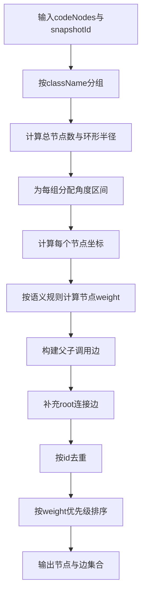

# P3-03 面向调用代码图的分组环形布局与语义加权渲染方法

- 状态：READY
- 优先级：P3
- 风险：中
- 分级：B（工程编排型）
- 独立性说明：不复用既有 P1/P2 主链，聚焦代码调用图布局与渲染算法，不涉及覆盖率增量、Git 差异评估或多源业务拓扑构建。

## 1) 专利名称

一种面向调用代码图的分组环形布局与语义加权渲染方法。

## 2) 背景技术

- 调用链可视化常见问题是节点数量增大后互相遮挡，难以快速定位关键代码节点。
- 传统随机或简单树形布局在存在大量同包类调用时，边交叉严重，阅读成本高。
- 不同类型代码节点（controller、service、entity 等）缺乏统一权重表达，导致关注优先级不清晰。

## 3) 现有缺陷

- 缺乏“同类分组 + 全局均衡”的布局策略。
- 缺乏类型语义到视觉优先级的映射规则。
- 缺乏布局结果与边关系的一体化去重输出机制。

## 4) 技术方案

- 按类名对调用节点进行分组，形成稳定的分区集合。
- 按分组规模将节点映射到环形角度区间，实现全局均匀铺展。
- 基于类路径与类名语义计算节点权重，并映射渲染优先级。
- 根据父子调用关系构建边集合，并对节点元素做 ID 级去重。
- 输出排序后的节点和边，支持前端按优先级稳定渲染。

### 变量及字段说明

- `V` 表示输入代码节点集合；`E_raw` 表示原始父子边集合；`F` 表示节点语义特征；`G = (V', E')` 表示最终可渲染图，其中 `V'` 为输出节点集合，`E'` 为输出边集合。
- `groups` 表示按类名或包名分组后的节点集合；`baseRadius` 表示基础环形半径；`alpha` 表示节点规模对半径的放大系数；`thetaStart`、`thetaEnd` 表示分组占用的角度起止位置；`step(g)` 表示组内相邻节点的角度步长。
- `x`、`y` 表示节点在二维平面中的坐标；`weight` 表示节点语义权重；`parentId`、`childId` 表示边两端节点标识。
- `codeNodes` 表示输入的调用代码节点数组；`snapshotId` 表示所属快照标识；`className` 表示类名；`id` 表示节点唯一标识；`nodes`、`edges` 表示最终返回的节点数组和边数组；`removedEdges` 表示被去除的无效或自环边。

### 4.1 算法问题定义

- 输入：代码节点集合 `V`，父子关系集合 `E_raw`，节点语义特征 `F`。
- 输出：可渲染图 `G = (V', E')`，其中节点包含坐标与权重。
- 目标：最小化边交叉与视觉拥挤，同时保持关键语义节点优先可见。

### 4.2 核心算法（分组环形布局+语义加权）

```text
Algorithm RingWeightedLayout(V, E_raw):
  groups <- GroupByClass(V)
  R <- baseRadius + alpha * |V|
  V' <- []
  for each group g in groups:
    [thetaStart, thetaEnd] <- AllocateAngleByGroupSize(g, |V|)
    for i, node in enumerate(g):
      theta <- thetaStart + i * step(g)
      node.x <- R * cos(theta)
      node.y <- R * sin(theta)
      node.weight <- SemanticWeight(node)
      V'.add(node)

  E' <- BuildEdges(E_raw)
  E' <- RemoveSelfLoop(E')
  V' <- DeduplicateById(V')
  V' <- SortByWeight(V')
  return (V', E')
```

### 4.3 复杂度分析

- 分组与坐标分配：`O(|V|)`。
- 边构建：`O(|E|)`。
- 去重与排序：`O(|V| log |V|)`（排序主导）。
- 总体复杂度：`O(|E| + |V| log |V|)`。

### 4.4 量化指标建议

- 边交叉下降率：相对基线布局的交叉数降幅。
- 关键节点命中率：高权重节点在首屏可见比例。
- 平均渲染耗时：节点规模分桶统计。
- 可读性评分：评审人员盲评得分提升。

## 5) 本发明创造的优点、有益的技术效果

- 在节点规模增长时仍保持较好的可读性与分布均衡性。
- 将“代码类型语义”转化为可视化优先级，提升问题定位效率。
- 通过统一去重与排序机制降低前端二次处理复杂度。

## 6) 权利要求草案

### 独立权利要求1（一句话）

一种调用代码图渲染方法，其特征在于：对调用节点执行按类分组的环形区间布局，并基于节点语义计算权重后排序输出去重节点与边集合，以实现可视化优先级一致的调用图展示。

### 从属权利要求2-5

- 权利要求2：根据权利要求1所述方法，其特征在于，环形布局半径按节点总量动态调整。
- 权利要求3：根据权利要求1所述方法，其特征在于，分组节点按所属角度区间线性展开，保持组内相对顺序。
- 权利要求4：根据权利要求1所述方法，其特征在于，节点权重由类路径关键词与类名关键词共同判定。
- 权利要求5：根据权利要求1所述方法，其特征在于，输出阶段对节点按标识去重并按权重优先级排序。

### 技术关键点和欲保护点

- 技术关键点：分组环形布局、语义权重映射、关系边构建、去重排序输出。
- 欲保护点：保护“分组 -> 环形分配 -> 语义加权 -> 去重排序”的可视化处理链。

## 7) 发明内容

本方案由以下五个部件组成，各部件顺序衔接，共同完成调用代码图的布局与渲染数据生成。

### 部件一：分组归类部件

**职责**：按类名或包名把调用节点划分为若干稳定分组。

具体而言，该部件把同类或同包的代码节点归入同一组，为后续角度分配和组内顺序保持提供基础。数据上，例如 `OrderController#create`、`OrderServiceImpl#createOrder`、`OrderRepository#save`、`OrderEntity#setStatus`、`LogAspect#around` 这 `5` 个节点可先被组织为若干类分组。

### 部件二：环形分配部件

**职责**：依据总节点数和组内节点数为每个分组分配角度区间，并计算节点坐标。

具体而言，该部件按 `R = baseRadius + alpha * |V|` 计算环半径，再为每个分组分配 `[thetaStart, thetaEnd]` 区间，使节点在圆周上均匀铺展。数据上，例如 `|V|=5` 时，可计算得到一组稳定的 `(x,y)` 坐标，如 `OrderController#create -> (420,0)`。

### 部件三：语义加权部件

**职责**：根据类路径和类名语义识别 controller、service、entity、aop 等类型，并赋予视觉优先级。

具体而言，该部件把业务入口和核心服务赋予较高权重，把实体类、切面类等赋予较低权重，形成稳定渲染顺序。数据上，例如 `controller` 节点可赋权 `30`，`service` 赋权 `20`，`entity` 与 `aop` 赋权 `10` 或 `0`。

### 部件四：边关系构建部件

**职责**：依据父子调用关系生成边元素，并净化掉自环或无效边。

具体而言，该部件把原始 `parentId -> childId` 关系转换为可渲染边集合，并删除如 `ServiceImpl -> ServiceImpl` 这类自环边。数据上，例如输入边 `Controller -> ServiceImpl`、`ServiceImpl -> Repository`、`ServiceImpl -> Entity`、`ServiceImpl -> ServiceImpl` 时，最终会过滤掉最后一条自环边。

### 部件五：去重排序部件

**职责**：按节点 ID 去重并按权重优先级排序，输出前端可直接渲染的稳定节点边集合。

具体而言，该部件先删除重复节点，再按 `weight` 从高到低排序，让关键节点优先出现在前端可视区域。数据上，例如输出顺序可稳定为 `OrderController#create`、`OrderServiceImpl#createOrder`、`OrderEntity#setStatus`、`LogAspect#around`、`OrderRepository#save`。

## 8) 具体实施例

### 实施例：订单创建链路的分组环形布局与渲染

某次代码调用图生成时的输入数据如下：

| 节点 | 语义类型 |
|---|---|
| `OrderController#create` | `controller` |
| `OrderServiceImpl#createOrder` | `service` |
| `OrderRepository#save` | `repository` |
| `OrderEntity#setStatus` | `entity` |
| `LogAspect#around` | `aop` |

原始调用边为：

- `Controller -> ServiceImpl`
- `ServiceImpl -> Repository`
- `ServiceImpl -> Entity`
- `ServiceImpl -> ServiceImpl`（自环）

按各部件执行后的处理过程如下：

1. **分组归类部件**先按类名把 `5` 个节点组织成稳定分组。
2. **环形分配部件**计算 `R=base+alpha*5`，并为各组分配角度区间，得到如下示意坐标：
   - `OrderController#create -> (420, 0)`；
   - `OrderServiceImpl#createOrder -> (130, 398)`；
   - `OrderRepository#save -> (-339, 247)`；
   - `OrderEntity#setStatus -> (-339, -247)`；
   - `LogAspect#around -> (130, -398)`。
3. **语义加权部件**按照语义类型赋权：`controller=30`、`service=20`、`entity=10`、`aop=10`、`repository=0`。
4. **边关系构建部件**根据父子调用生成边集合，并删除自环边 `ServiceImpl -> ServiceImpl`。
5. **去重排序部件**对节点按权重排序后输出，结果示例如下：

```json
{
  "nodes": [
    {"id": "OrderController#create", "weight": 30, "x": 420, "y": 0},
    {"id": "OrderServiceImpl#createOrder", "weight": 20, "x": 130, "y": 398},
    {"id": "OrderEntity#setStatus", "weight": 10, "x": -339, "y": -247},
    {"id": "LogAspect#around", "weight": 10, "x": 130, "y": -398},
    {"id": "OrderRepository#save", "weight": 0, "x": -339, "y": 247}
  ],
  "edges": [
    ["OrderController#create", "OrderServiceImpl#createOrder"],
    ["OrderServiceImpl#createOrder", "OrderRepository#save"],
    ["OrderServiceImpl#createOrder", "OrderEntity#setStatus"]
  ],
  "removedEdges": [["OrderServiceImpl#createOrder", "OrderServiceImpl#createOrder"]]
}
```

本实施例中，系统先把节点做分组和环形铺展，再通过语义权重突出 controller 与 service 等关键节点，并删除自环噪声边。这样在相同输入规模下，前端可直接得到结构更稳定、关键节点更靠前的渲染结果。

### 效果图

图2：分组环形布局与语义加权渲染效果示意

```
┌─────────────────────────────────────────────────────────────────────────────────────┐
│  调用代码图 - 环形布局                              快照ID: snap-20260320           │
├─────────────────────────────────────────────────────────────────────────────────────┤
│                                                                                     │
│                              ┌────────────────────┐                                │
│                              │ OrderController#create                             │
│                              │   weight: 30       │                                │
│                              │   (controller)     │                                │
│                              └─────────┬──────────┘                                │
│                                        │                                            │
│                    ┌───────────────────┼───────────────────┐                        │
│                    │                   │                   │                        │
│                    ▼                   │                   ▼                        │
│       ┌────────────────────┐          │       ┌────────────────────┐                │
│       │ OrderServiceImpl   │          │       │ LogAspect#around   │                │
│       │ #createOrder       │          │       │   weight: 10       │                │
│       │   weight: 20       │          │       │   (aop)            │                │
│       │   (service)        │          │       └────────────────────┘                │
│       └────────┬───────────┘          │                                            │
│                │                      │                                            │
│        ┌───────┴───────┐              │                                            │
│        ▼               ▼              │                                            │
│  ┌──────────────┐  ┌──────────────┐   │                                            │
│  │OrderRepository│  │ OrderEntity  │   │                                            │
│  │   #save       │  │ #setStatus   │   │                                            │
│  │  weight: 0    │  │  weight: 10  │   │                                            │
│  │  (repository) │  │  (entity)    │   │                                            │
│  └──────────────┘  └──────────────┘   │                                            │
│                                       │                                            │
│  ─────────────────────────────────────────────────────────────────────────────     │
│                                                                                     │
│  权重优先级: controller(30) > service(20) > entity/aop(10) > repository(0)          │
│  渲染顺序: 按 weight 降序，关键节点优先显示在可视区域                               │
│  边统计: 有效边 3 条 | 删除自环边 1 条 (ServiceImpl→ServiceImpl)                    │
│                                                                                     │
│  图例: ● 高权重(controller)  ● 中权重(service)  ● 低权重(entity/aop/repository)    │
│                                                                                     │
└─────────────────────────────────────────────────────────────────────────────────────┘
```

## 9) 附图

图1：调用代码图分组环形布局流程图（Mermaid）



## 10) 证据锚点（READY）

- `oAT-service/oAT-service-web/src/main/java/com/oAT/web/domain/StackCodeLayer.java` `elements()` 行 20-84。
- `oAT-service/oAT-service-web/src/main/java/com/oAT/web/domain/StackCodeLayer.java` `weightOrder(...)` 行 86-93。
- `oAT-service/oAT-service-web/src/main/java/com/oAT/web/domain/StackCodeLayer.java` `buildNode(...)` 行 95-196。
- `oAT-service/oAT-service-web/src/main/java/com/oAT/web/domain/StackCodeLayer.java` `buildEdges(...)` 行 206-220。
- `oAT-service/oAT-service-web/src/main/java/com/oAT/web/control/MapControl.java` `getMapStackCodeNode(...)` 行 129-152。
- `oAT-service/oAT-service-web/src/main/java/com/oAT/web/control/MapControl.java` `getStackCodeNode(...)` 行 207-218。
