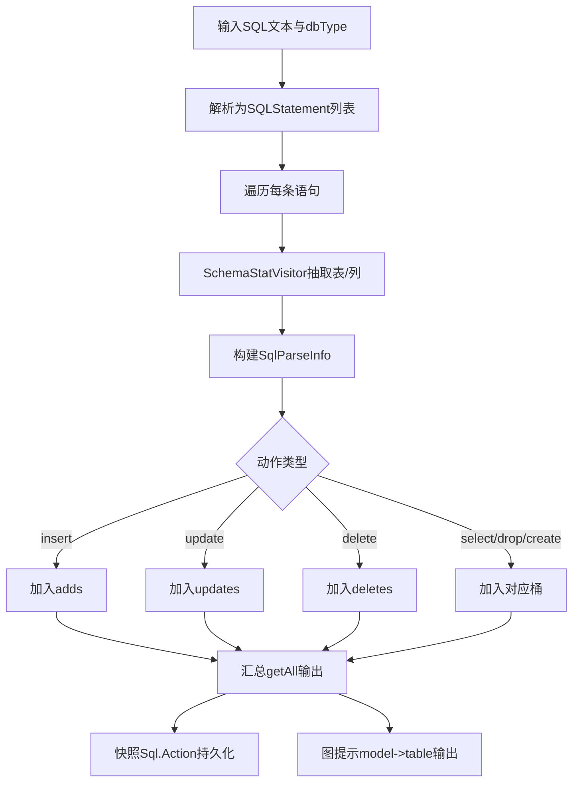

# P3-04 面向跨数据库链路分析的 SQL 动作语义抽取方法

- 状态：READY
- 优先级：P3
- 风险：中
- 分级：B（工程编排型）
- 独立性说明：不复用既有 P1/P2/P3-01~P3-03 主链，聚焦 SQL 语句到动作语义对象的标准化抽取，不以覆盖率增量、缓存增量拉取、调用图布局为核心。

## 1) 专利名称

一种面向跨数据库链路分析的 SQL 动作语义抽取方法。

## 2) 背景技术

- 运行链路中的 SQL 文本通常直接展示，难以快速提炼"对哪个表执行了哪类操作"。
- 不同数据库类型在语法细节上存在差异，导致语义统计口径不统一。
- 多语句、复杂 SQL 场景下，缺少可复用的结构化语义抽取与归类机制。

## 3) 现有缺陷

- 缺乏数据库无关的动作语义抽取流程。
- 缺乏"表级动作 + 列信息"的一体化建模。
- 缺乏可直接复用于快照持久化与图节点提示的统一输出结构。

## 4) 技术方案

- 输入 SQL 文本与数据库类型，构建语句列表并逐条解析。
- 基于语法树访问器抽取目标表、操作类型与列信息。
- 将操作类型映射到标准动作集合（insert/update/delete/select/drop/create）。
- 输出统一的 `SqlParseInfo` 结构列表，支持多语句合并处理。
- 在快照构建场景中，映射为 `Sql.Action` 语义对象并持久化。
- 在图展示场景中，将语义对象转为 `model -> table` 提示文本并去重输出。

### 变量及字段说明

- `SqlParseInfo` 表示统一的 SQL 语义对象；`Q` 表示输入 SQL 文本集合；`dbType` 表示数据库类型；`A` 表示输出的动作语义集合。
- `result` 表示处理中间结果列表；`sql` 表示单条 SQL 文本；`stmts` 表示解析后的语句对象列表；`visitor` 表示语法树访问器；`info` 表示当前构建的单个 SQL 语义对象。
- `tables` 表示访问器抽取出的目标表集合；`columns` 表示访问器抽取出的列集合；`model` 表示标准化动作类型；`table` 表示目标表名。
- `ParseStatements` 表示"按数据库类型解析 SQL 语句列表"的处理步骤；`BuildSchemaVisitor` 表示"构建语法树访问器"的处理步骤；`NormalizeModel` 表示"把原始动作归一为标准动作"的处理步骤；`BucketByModel` 表示"按动作类型分桶汇总"的处理步骤。
- `selects`、`updates` 表示结果中按动作类型分桶后的查询语义数组和更新语义数组。

### 4.1 算法问题定义

- 输入：SQL 文本集合 `Q`、数据库类型 `dbType`。
- 输出：动作语义集合 `A = {(model, table, columns)}`。
- 目标：在跨库语法差异下最大化动作识别准确率并最小化误报。

### 4.2 核心算法（跨库动作语义抽取）

```text
Algorithm CrossDbSqlSemanticExtract(Q, dbType):
  result <- []
  for sql in Q:
    stmts <- ParseStatements(sql, dbType)
    for stmt in stmts:
      visitor <- BuildSchemaVisitor(dbType)
      stmt.accept(visitor)
      for table in visitor.tables:
        info <- new SqlParseInfo(table.name, NormalizeModel(table.op))
        for col in visitor.columns:
          if col.table == table.name:
            info.addColumn(col.name)
        result.add(info)
  return BucketByModel(result)
```

### 4.3 复杂度与鲁棒性

- 时间复杂度：`O(s + t + c)`，`s` 为语句数，`t` 为表项数，`c` 为列项数。
- 空间复杂度：`O(t + c)`。
- 鲁棒性策略：动作归一字典 + 表列一致性约束，降低跨库方言差异影响。

### 4.4 量化指标建议

- 动作识别准确率（Action Accuracy）。
- 表级召回率（Table Recall）。
- 误报率（False Positive Rate）。
- 跨库一致性得分（同SQL在不同dbType下语义一致比例）。

## 5) 本发明创造的优点、有益的技术效果

- 统一 MySQL/ClickHouse 等场景下的 SQL 行为语义口径。
- 将原始 SQL 文本转化为可检索、可聚合、可展示的结构化语义。
- 同一抽取结果可复用于快照落库和拓扑提示，减少重复解析成本。

## 6) 权利要求草案

### 独立权利要求1（一句话）

一种 SQL 语义抽取方法，其特征在于：接收 SQL 文本与数据库类型后通过语法树访问器抽取表与列信息，将语句动作映射到标准动作集合并生成统一语义对象列表，以支持持久化与可视化双场景复用。

### 从属权利要求2-5

- 权利要求2：根据权利要求1所述方法，其特征在于，支持将输入 SQL 解析为多条语句并逐条抽取语义。
- 权利要求3：根据权利要求1所述方法，其特征在于，对抽取结果按动作类型分桶存储并支持统一汇总访问。
- 权利要求4：根据权利要求1所述方法，其特征在于，列信息仅在所属目标表匹配时写入语义对象。
- 权利要求5：根据权利要求1所述方法，其特征在于，同一语义对象可同时用于快照动作持久化与图提示文本生成。

### 技术关键点和欲保护点

- 技术关键点：跨库语法树访问、表列关联、动作标准化映射、双场景复用。
- 欲保护点：保护"解析 -> 抽取 -> 映射 -> 统一输出 -> 场景复用"的语义抽取主链。

## 7) 发明内容

本方案由以下五个部件组成，各部件顺序衔接，共同完成 SQL 文本到动作语义对象的标准化抽取。

### 部件一：语句解析部件

**职责**：接收 SQL 文本和数据库类型，并把输入解析为可遍历的语句对象集合。

具体而言，该部件支持 MySQL、ClickHouse 等不同数据库类型，能够把单条 SQL 或多语句文本拆分为统一语句列表。数据上，例如 `SELECT id, status FROM order_info WHERE id = ?` 与 `UPDATE order_info SET status = ? WHERE id = ?` 会被分别解析为可遍历语句对象。

### 部件二：语义抽取部件

**职责**：访问语法树，抽取目标表、列集合和原始动作信息。

具体而言，该部件借助 schema visitor 收集 `tables` 与 `columns`，并保证列信息只写入所属目标表。数据上，例如 `SELECT id, status FROM order_info WHERE id = ?` 可抽取出 `table=order_info`、`columns=[id,status]`。

### 部件三：动作归类部件

**职责**：把原始动作归一到标准动作集合，并按动作类型分桶管理。

具体而言，该部件把数据库语法差异映射为 `insert/update/delete/select/drop/create` 等统一动作标签，使跨库输出口径保持一致。数据上，例如 MySQL 的查询语句和 ClickHouse 的查询语句最终都归一为 `model=select`。

### 部件四：统一输出部件

**职责**：把抽取结果组织为统一的 `SqlParseInfo` 列表和汇总视图。

具体而言，该部件输出的结构至少包含 `table`、`columns`、`model` 等字段，并支持多语句结果一起返回。数据上，例如同一次请求中可同时得到 `order_info` 的 `select` 语义和 `update` 语义，前端或业务层无需再重复解析原始 SQL。

### 部件五：场景适配部件

**职责**：把统一语义对象分别映射到快照持久化场景和图提示展示场景。

具体而言，该部件在快照构建时生成 `Sql.Action` 数组，在图展示时生成 `model -> table` 的提示文本。数据上，例如 `select -> order_info` 和 `update -> order_info` 既可写入快照语义字段，也可直接显示在数据库节点的提示信息中。

## 8) 具体实施例

### 实施例：MySQL 与 ClickHouse SQL 的动作语义抽取

某次 SQL 语义抽取请求的输入数据如下：

| SQL | 数据库类型 |
|---|---|
| `SELECT id, status FROM order_info WHERE id = ?` | `mysql` |
| `UPDATE order_info SET status = ? WHERE id = ?` | `mysql` |
| `SELECT count(1) FROM dwd_order WHERE dt = '2026-03-10'` | `clickhouse` |

按各部件执行后的处理过程如下：

1. **语句解析部件**按 `dbType` 把上述 SQL 解析为三条独立语句对象。
2. **语义抽取部件**依次提取表与列：
   - 第一条 SQL 抽取 `table=order_info`、`columns=[id,status]`；
   - 第二条 SQL 抽取 `table=order_info`、`columns=[status,id]`；
   - 第三条 SQL 抽取 `table=dwd_order`、`columns=[dt]`。
3. **动作归类部件**把第一条和第三条归一为 `select`，第二条归一为 `update`。
4. **统一输出部件**汇总生成跨库一致的动作语义结果。
5. **场景适配部件**把结果同时映射为快照持久化对象和图提示文本，输出如下：

```json
{
  "mysql": {
    "selects": [
      {"table": "order_info", "columns": ["id", "status"], "model": "select"}
    ],
    "updates": [
      {"table": "order_info", "columns": ["status", "id"], "model": "update"}
    ]
  },
  "clickhouse": {
    "selects": [
      {"table": "dwd_order", "columns": ["dt"], "model": "select"}
    ]
  }
}
```

本实施例中，系统把不同数据库类型下的 SQL 文本统一抽取为"动作-表-列"结构化语义，并保持 `select`、`update` 等动作标签的一致表达，因此同一批结果既可用于快照语义持久化，也可直接用于数据库节点提示展示。

### 效果图

图2：跨数据库 SQL 动作语义抽取效果示意

```
┌─────────────────────────────────────────────────────────────────────────────────────┐
│  SQL 动作语义抽取结果                                                                │
├─────────────────────────────────────────────────────────────────────────────────────┤
│                                                                                     │
│  输入 SQL 文本 (跨库)                                                               │
│  ─────────────────────────────────────────────────────────────────────────────      │
│  ┌─ MySQL ───────────────────────────────────────────────────────────────────┐    │
│  │ 1. SELECT id, status FROM order_info WHERE id = ?                         │    │
│  │ 2. UPDATE order_info SET status = ? WHERE id = ?                          │    │
│  └────────────────────────────────────────────────────────────────────────────┘    │
│  ┌─ ClickHouse ──────────────────────────────────────────────────────────────┐    │
│  │ 3. SELECT count(1) FROM dwd_order WHERE dt = '2026-03-10'                 │    │
│  └────────────────────────────────────────────────────────────────────────────┘    │
│                                     ↓ 语义抽取 + 动作归类                            │
│  ┌─ 统一语义输出 ─────────────────────────────────────────────────────────────┐    │
│  │                                                                            │    │
│  │  MySQL:                                                                    │    │
│  │  ┌────────────────────────────────────────────────────────────────────┐   │    │
│  │  │ model: select │ table: order_info │ columns: [id, status]          │   │    │
│  │  └────────────────────────────────────────────────────────────────────┘   │    │
│  │  ┌────────────────────────────────────────────────────────────────────┐   │    │
│  │  │ model: update │ table: order_info │ columns: [status, id]          │   │    │
│  │  └────────────────────────────────────────────────────────────────────┘   │    │
│  │                                                                            │    │
│  │  ClickHouse:                                                               │    │
│  │  ┌────────────────────────────────────────────────────────────────────┐   │    │
│  │  │ model: select │ table: dwd_order │ columns: [dt]                   │   │    │
│  │  └────────────────────────────────────────────────────────────────────┘   │    │
│  │                                                                            │    │
│  └────────────────────────────────────────────────────────────────────────────┘    │
│                                                                                     │
│  ┌─ 场景适配输出 ─────────────────────────────────────────────────────────────┐    │
│  │                                                                            │    │
│  │  快照持久化: Sql.Action[] = [{model:"select",table:"order_info"},...]     │    │
│  │  图提示文本: "select → order_info", "update → order_info"                 │    │
│  │                                                                            │    │
│  └────────────────────────────────────────────────────────────────────────────┘    │
│                                                                                     │
│  统计: 动作识别 3 条 | 表召回 2 表 | 跨库一致性 100%                                 │
│                                                                                     │
└─────────────────────────────────────────────────────────────────────────────────────┘
```

## 9) 附图

图1：跨数据库 SQL 动作语义抽取流程图（Mermaid）



## 10) 证据锚点（READY）

- `oAT-service/oAT-service-web/src/main/java/com/oAT/web/common/SqlStatParse.java` `parse(...)` 行 34-64。
- `oAT-service/oAT-service-web/src/main/java/com/oAT/web/common/SqlStatParse.java` `getAll()` 行 90-99。
- `oAT-service/oAT-service-web/src/main/java/com/oAT/web/service/impl/SystemSnapshotServiceImpl.java` `buildSql(...)` 行 181-195。
- `oAT-service/oAT-service-web/src/main/java/com/oAT/web/service/impl/SystemSnapshotServiceImpl.java` `buildCKSql(...)` 行 197-211。
- `oAT-service/oAT-service-web/src/main/java/com/oAT/web/control/GraphViewHelp.java` SQL 节点提示生成 行 202-229。
